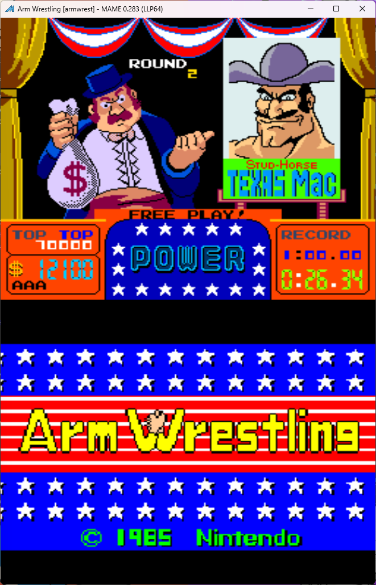
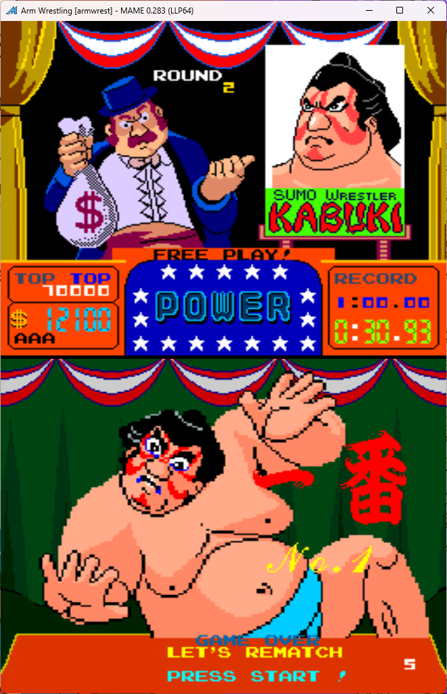

# Arm Wrestling Freeplay
This is a mod to original Arm Wrestling ROMs that adds free play to the game. 

## Patch information
### Freeplay
One patch file is provided for the *armwrest* ROM set as found in MAME. It has been tested for this ROM set only and may not work on other revisions of Arm Wrestling. The patches are designed to be used with LunarIPS. 

| **Patched ROM Name** | **Size** | **CRC-32 Checksum** | **IC Location** |
|----------------------|----------|---------------------|-----------------|
| chv1-c.8l            |    8k    |       EB08820E      |        8L       |

### Hard Mode + Freeplay
One patch file is provided for the *armwrest* ROM set as found in MAME. It has been tested for this ROM set only and may not work on other revisions of Arm Wrestling. The patches are designed to be used with LunarIPS. 

With free play enabled, the game can be considered to be too easy because of how many times you can rematch. This patch changes the dip switch option for rematch, changing it to the following:
DIPSW2 SW *O*
- Off: 3 rematch
- On: 1 rematch

| **Patched ROM Name** | **Size** | **CRC-32 Checksum** | **IC Location** |
|----------------------|----------|---------------------|-----------------|
| chv1-c_hard.8l       |    8k    |       23D86530      |        8L       |

## Modification Documentation
to do

## Images

