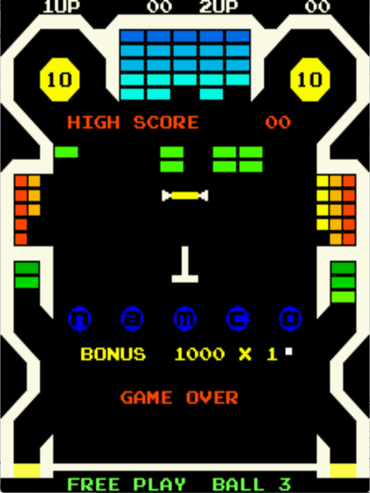

# Bomb Bee Freeplay
This is a mod to original Bomb Bee ROMs that adds attract mode to the free play setting. It can be used with credits enabled as well as free play mode. These patches are meant to be used with LunarIPS or other similar patching utilities.

## Patch information
### Supported ROM Sets
| **ROM Set** | **MAME Working?** | **Machine Working?** |
|-------------|:-----------------:|:--------------------:|
| bombbee     |        Yes        |       Untested       |

| **Patched ROM Name** | **Size** | **CRC-32 Checksum** | **IC Location** |
|----------------------|----------|---------------------|-----------------|
| tmm333.1k            |    4k    |       4AAECCDE      |        1k       |
| tmm333.2k            |    4k    |       FDF20ECA      |        2k       |

## DIP Switch Setting
This is found on DPSW 1 on the game PCB. It uses switches 1 and 2.

| **Coin/Credit** | **1** | **2** |
|----------------:|:-----:|:-----:|
|             2/1 |   On  |  Off  |
|             1/1 | *Off* | *Off* |
|             1/2 |  Off  |   On  |
|       Free Play |   On  |   On  |

## Modification Documentation
To Do

## Images

