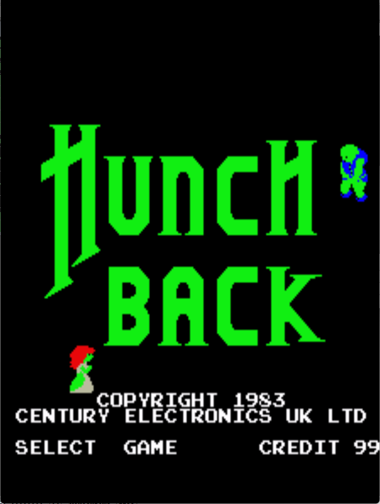

# Hunchback Freeplay
This is a freeplay with attract mod for Hunchback, a conversion kit for DK PCBs. These patches are meant to be used with LunarIPS or other similar patching utilities.

## Patch information
### Supported ROM Sets
| **ROM Set** | **MAME Working?** | **Machine Working?** |
|-------------|:-----------------:|:--------------------:|
| hunchbdk    |        Yes        |       Untested       |

### hunchbdk
| **Patched ROM Name** | **Size** | **CRC-32 Checksum** | **IC Location** |
|----------------------|----------|---------------------|-----------------|
| hb.5a                |    4k    |       8F921638      |       5A        |
| hb.5b                |    4k    |       B75F6BC6      |       5B        |
| hb.5e                |    4k    |       8248418E      |       5E        |

## Modification Documentation
To Do

## Images

