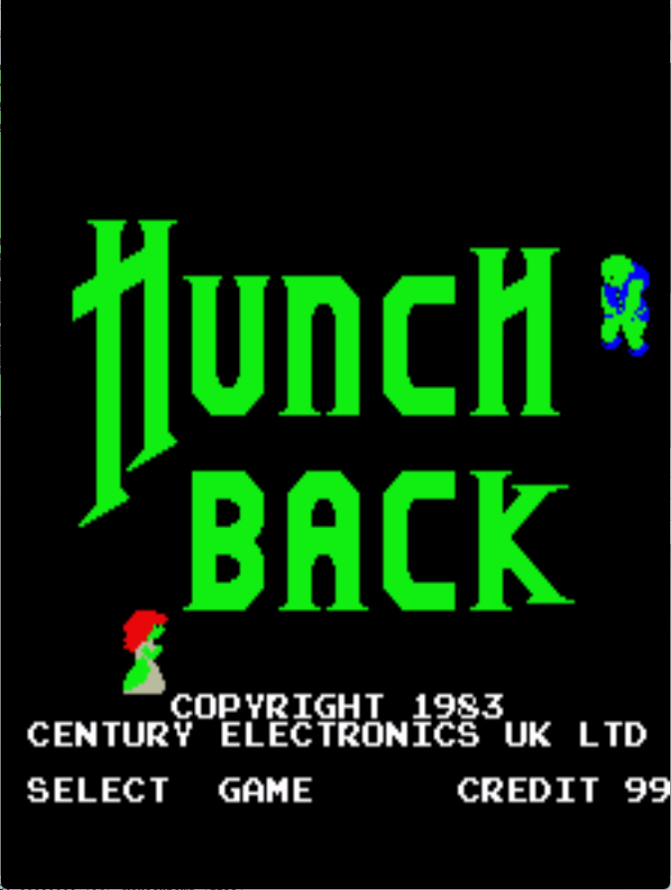

# Hunchback Freeplay
This is a freeplay with attract mod for Hunchback, a conversion kit for DK PCBs. These patches are meant to be used with LunarIPS or other similar patching utilities.

## Patch information
### Supported ROM Sets
| **ROM Set** | **MAME Working?** | **Machine Working?** |
|-------------|:-----------------:|:--------------------:|
| hunchbdk    |        Yes        |       Untested       |

### hunchbdk
| **Patched ROM Name** | **Size** | **CRC-32 Checksum** | **IC Location** |
|----------------------|----------|---------------------|-----------------|
| hb.5b                |    4k    |       A79E7B3D      |       5B        |
| hb.5e                |    4k    |       97F9C07F      |       5E        |

## Modification Documentation
### Noteworthy Locations in Memory
$1D98 - Credit Count

### Modifications
The methodology for the 2650 DK Kit Mods is very straight forward:
- Instead of printing credit count, load 40 credits into the credit count variable
- Replace "Credit" text with "Free Play"

## Images

