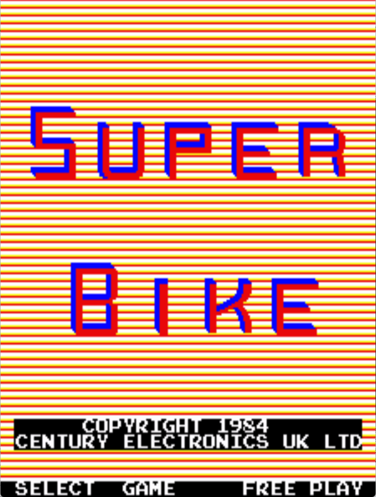

# Super Bike Freeplay
This is a freeplay with attract mod for Super Bike, a conversion kit for DK PCBs. These patches are meant to be used with LunarIPS or other similar patching utilities.

## Patch information
### Supported ROM Sets
| **ROM Set** | **MAME Working?** | **Machine Working?** |
|-------------|:-----------------:|:--------------------:|
| sbdk        |        Yes        |       Untested       |

### sbdk
| **Patched ROM Name** | **Size** | **CRC-32 Checksum** | **IC Location** |
|----------------------|----------|---------------------|-----------------|
| sb-dk.5a             |    4k    |       7F2EE3A5      |       5A        |
| sb-dk.as             |    4k    |       34F9961F      |       5B        |
| sb-dk.ay             |    4k    |       254B98EE      |       5C        |
| sb-dk.ap             |    4k    |       2C891E33      |       5E        |

## Modification Documentation
To Do

## Images

