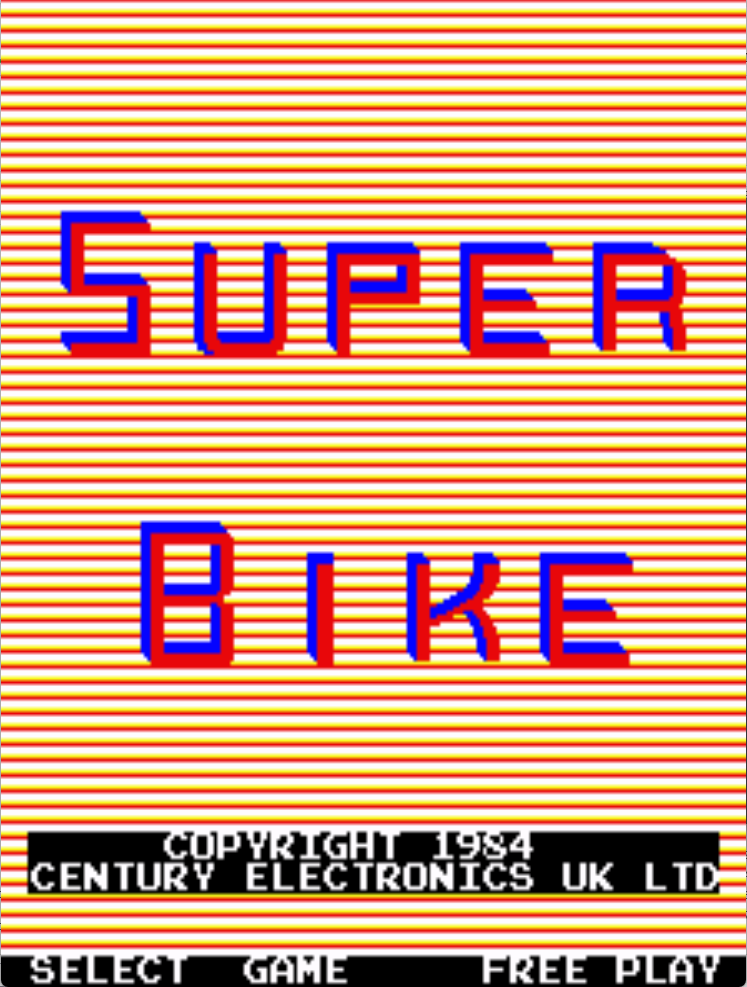
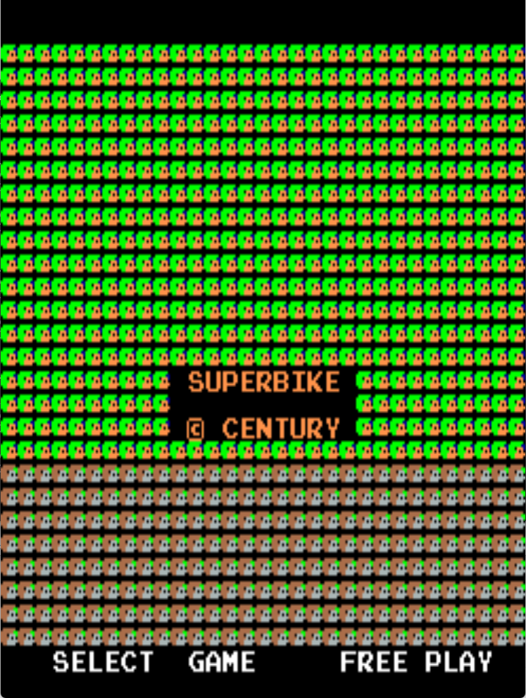
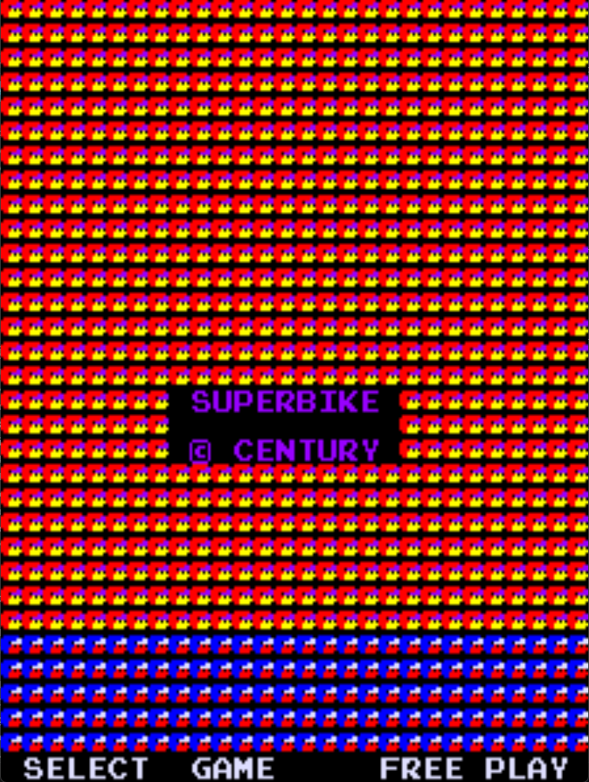

# Super Bike Freeplay
This is a freeplay with attract mod for Super Bike, a conversion kit for DK, Galaxian, and CVS kits. These patches are meant to be used with LunarIPS or other similar patching utilities.

## Patch information
### Supported ROM Sets
| **ROM Set** | **MAME Working?** | **Machine Working?** |
|-------------|:-----------------:|:--------------------:|
| sbdk        |        Yes        |       Untested       |

### sbdk
| **Patched ROM Name** | **Size** | **CRC-32 Checksum** | **IC Location** |
|----------------------|----------|---------------------|-----------------|
| sb-dk.ay             |    4k    |       965D4E59      |       5C        |
| sb-dk.ap             |    4k    |       EDA649EB      |       5E        |

### superbik
| **Patched ROM Name** | **Size** | **CRC-32 Checksum** | **IC Location** |
|----------------------|----------|---------------------|-----------------|
| sb-gp1.bin           |    4k    |       3EFB0E98      |      ROM1       |
| sb-gp3.bin           |    4k    |       D435B0CF      |      ROM3       |

### superbikg
| **Patched ROM Name** | **Size** | **CRC-32 Checksum** | **IC Location** |
|----------------------|----------|---------------------|-----------------|
| moto2-2516.bin       |    2k    |       E10C2FA0      |                 |
| moto3-2516.bin       |    2k    |       8436C9B1      |                 |

## Modification Documentation
$1D9F - Credit Count (DK Kit)
$1E6A - Credit Count (CVS Kit)
$1D7A - Credit Count (Galaxian Kit)

### Modifications
The methodology for the 2650 DK Kit Mods is very straight forward:
- Instead of printing credit count, load 40 credits into the credit count variable
- Replace "Credit" text with "Free Play"

## Images

