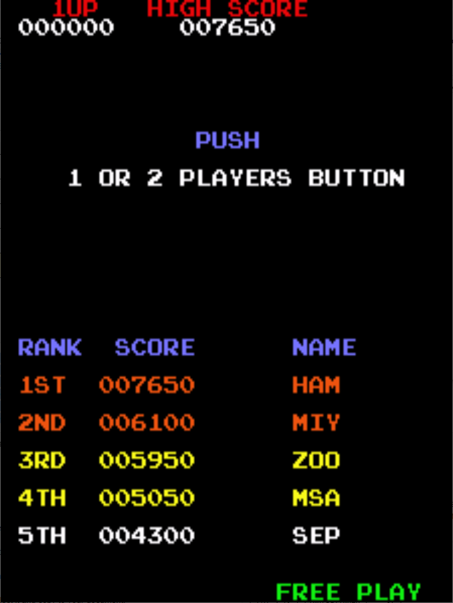

# Donkey Kong Jr Freeplay
This is a mod to original F-2 revision of the Donkey Kong Jr ROMs that adds free play to the game. 

## Patch information
One patch file is provided for the *dkongjr* ROM set as found in MAME. It has been tested for this ROM set only and may not work on other revisions of Donkey Kong Jr. The patches are designed to be used with LunarIPS. 


| **Patched ROM Name** | **Size** | **CRC-32 Checksum** | **IC Location** |
|----------------------|----------|---------------------|-----------------|
| djr1-c_5b_f-2.5b     |    8k    |       5E87E16F      |        5B       |

## Modification Documentation
### Noteworthy Places in Memory
- 6001: Credit Count
- 6003: Credit switch is held
- 6005: Game Mode
    - 0x00 = startup/not initialized
    - 0x01 = attract mode
    - 0x02 = credit screen, awaiting start
    - 0x03 = game mode
- 6007: Controls/Digital Sounds Enable
    - 0x01 = Disabled
    - 0x00 = Enabled
- 6080: Analog Sounds Queue
- 7D00: Controls
    - bit 7 = credit switch
    - bit 3 = 2P switch
    - bit 2 = 1P Start switch

### CPU ROM Addresses
Donkey Kong Jr's memory map is a bit odd. They split the chips themselves to be at different address ranges. 

| Location | Address Range   | Chip Size | Chip Type |
|----------|-----------------|-----------|-----------|
| 5B       | 0x0000 - 0x0FFF | 8k        | 2764      |
|          | 0x3000 - 0x3FFF |           |           |
| 5C       | 0x2000 - 0x27FF | 8k        | 2764      |
|          | 0x4800 - 0x4FFF |           |           |
|          | 0x1000 - 0x17FF |           |           |
|          | 0x5800 - 0x5FFF |           |           |
| 5E       | 0x4000 - 0x47FF | 8k        | 2764      |
|          | 0x2800 - 0x2FFF |           |           |
|          | 0x5000 - 0x57FF |           |           |
|          | 0x1800 - 0x1FFF |           |           |

### Added Routines
Many of these routines were added where the "Ikegami" text would have been since that data is not referenced by anything. As nice as it would have been to keep this routine, it was a good place to add my routines.

Many of these routines were re-used from my Radar Scope free play ROM.

#### Credit/Freeplay Routine
```z80asm
0x3F40   ld a, ($6005)   3A 05 60  //Load the game mode to check if it in attract
0x3F43   and $02         E6 02     //See if we are in credit screen or game mode
0x3F45   ret nz          C0        //Return if we are not in attract mode
0x3F46   ld a, ($7D00)   3A 00 7D  //Read the controls
0x3F49   ld b, a         47        //Copy the controls into b register for later use
0x3F4A   and $0C         E6 0C     //See if player 1 or player 2 has been pressed
0x3F4C   ret z           C8        //If return if neither has been pressed
0x3F4D   ld hl, $6007    21 81 7D  //Load game controls address   
0x3F50   ld (hl), $00    36 00     //Enable Game Mode, enables controls and digital sound
0x3F52   ld hl, $6005    21 05 60  //Load the game mode
0x3F55   inc (hl)        34        //Set the game mode to credit screen mode
0x3F56   ld hl, $6080    21 80 60  //Load the start of the analog sounds queue
0x3F59   ld c, $0F       0E 0F     //Load byte counter
0x3F5B   ld a, $00       3E 00     //Load clear value
0x3F5D   ld (hl), a      77        //Clear the value
0x3F5E   dec c           0D        
0x3F5F   inc hl          23
0x3F60   jp nz, $3F5D    C2 5D 3F  //We want to clear $3F80 to $3F8F, loop until done
0x3F63   ld hl, $6001    21 01 60  //Load the credit count
0x3F66   inc (hl)        34        //Insert the first coin, 1 is needed at a minimum
0x3F67   ld a, b         78        //Load the copied controls input
0x3F68   and $08         E6 08     //See if it is player 2 input
0x3F6A   jr z, $3F70     28 04     //If it wasn't P2 start, jump to p1 start
0x3F6C   inc (hl)        34        //Add the second coin for P2
0x3F6D   jp $0919        C3 19 09  //Jump to player 2 start routine
0x3F70   jp $0906        C3 06 09  //Jump to player 1 start routine
```

#### Routine to print "Free Play" text
```z80asm
0x3F77   ld de, $3F8D    11 8D 3F  //Load the "Free Play" string start address
0x3F7A   ld hl, $749F    21 9F 74  //Load the address for printing characters to screen
0x3F7D   ld bc, $0020    01 20 00  //Load the offset
0x3F80   ld a, (de)      1A        //Load the character to be printed
0x3F81   ld (hl), a      77        //Print the character to the screen
0x3F82   inc de          13        //Increment the string address pointer
0x3F83   add hl, bc      09        //Increment the screen address pointer
0x3F84   ld a, (de)      1A        //Load the next character to be printed
0x3F85   cp $FF          FE FF     //See if it is the end of the string (0xFF)
0x3F87   jp nz, $2C4A    C2 4A 2C  //If we still have characters to print, then loop
0x3F8A   ret             C9
```

#### Injected Routines
These were where all the lines of code that were changed inline for it to properly work.

- 0x017B  Ld a, $7D00  ->   Call $3F40
- 0x017E  bit 7,a      ->   and $00      //Never trigger the following code
- 0x061B  [routine]    ->   Call 3F77    //Routine to print free play
- 0x0782  Values here were changed in order to always print "Push Players Buttons" on high score screen

### Character Table (Incomplete)
|  Hex | Character |
|:----:|:---------:|
| 0x10 |  [Space]  |
| 0x11 |     A     |
| 0x12 |     B     |
| 0x13 |     C     |
| 0x14 |     D     |
| 0x15 |     E     |
| 0x16 |     F     |
| 0x17 |     G     |
| 0x18 |     H     |
| 0x19 |     I     |
| 0x1A |     J     |
| 0x1B |     K     |
| 0x1C |     L     |
| 0x1D |     M     |
| 0x1E |     N     |
| 0x1F |     O     |
| 0x20 |     P     |
| 0x21 |     Q     |
| 0x22 |     R     |
| 0x23 |     S     |
| 0x24 |     T     |
| 0x25 |     U     |
| 0x26 |     V     |
| 0x27 |     W     |
| 0x28 |     X     |
| 0x29 |     Y     |
| 0x2A |     Z     |

Free Play = 16 22 15 15 10 20 1C 11 29

### String List (Likely Incomplete)
This was a list of strings of characters used by the game. It was used for printing text like "1 or 2 Players Button". I used this table to make sure that I was printing the "Push 1 or 2 players button" text to the screen at the appropriate time. It was better to re-use the logic that was already there. This list is  likely incomplete, but these were the ones I documented.

| **Hex** |         **String**        |
|:-------:|:-------------------------:|
|   0x00  |          [Blank?]         |
|   0x01  |          [Blank?]         |
|   0x02  |          [Blank?]         |
|   0x04  |     [Credit Pricing?]     |
|   0x05  |     [Player Coin Text]    |
|   0x0A  |   1 or 2 players button   |
|   0x0B  |      1 player button      |
|   0x0C  |            Push           |
|   0x14  |           Credit          |
|   0x15  |    [Top 2 High Scores]    |
|   0x16  |   [3rd Place High Score]  |
|   0x17  |   [4th Place High Score]  |
|   0x18  |   [5th Place High Score]  |
|   0x19  | [High Score Table Header] |
|   0x1B  |        Insert Coin        |
|   0x1C  |        Player Coin?       |
|   0x1E  |    [Nintendo Copyright]   |

- 2C60: Free Play String (backwards)
    - 29 11 1C 20 10 15 15 22 16

## Images

