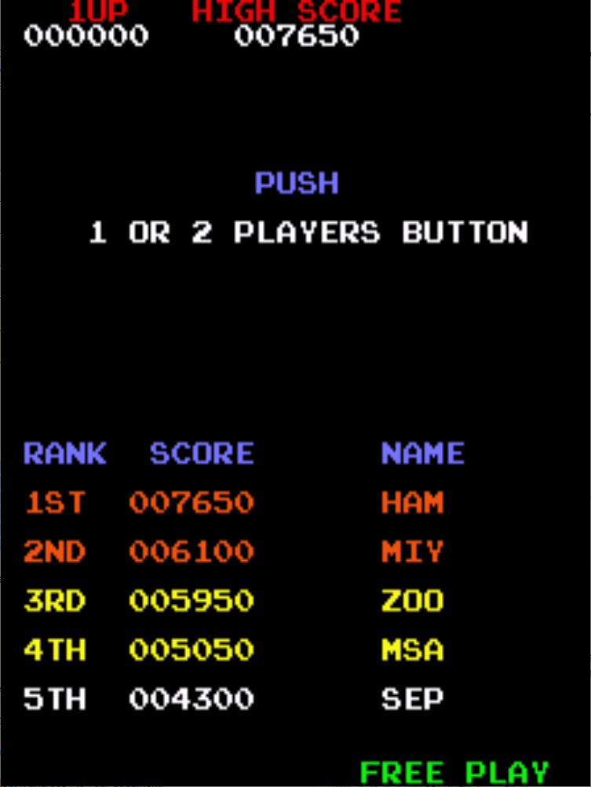

# Donkey Kong Jr Freeplay
This is a mod for several Donkey Kong Jr ROM sets. These patches are intended to be used with LunarIPS or similar patching utilities.

## Patch information
### Supported ROM Sets
| **ROM Set** | **MAME Working?** | **Machine Working?** |
|-------------|:-----------------:|:--------------------:|
| dkongjr     |        Yes        |          Yes         |
| dkongjrj    |        Yes        |       Untested       |
| dkongjrb    |        Yes        |       Untested       |

### US Set F-2 - dkongjr
| **Patched ROM Name** | **Size** | **CRC-32 Checksum** | **IC Location** |
|----------------------|----------|---------------------|-----------------|
| djr1-c_5b_f-2.5b     |    8k    |       894A38ED      |        5B       |

### Japan Set - dkongjrj
| **Patched ROM Name** | **Size** | **CRC-32 Checksum** | **IC Location** |
|----------------------|----------|---------------------|-----------------|
| c_5ba                |    8k    |       7B8822BF      |        5B       |

### Bootleg - dkongjrb
| **Patched ROM Name** | **Size** | **CRC-32 Checksum** | **IC Location** |
|----------------------|----------|---------------------|-----------------|
| dkjr1                |    8k    |       BB96B0CA      |        5B       |

## Modification Documentation
### Noteworthy Places in Memory
- 6001: Credit Count
- 6003: Credit switch is held
- 6005: Game Mode
    - 0x00 = startup/not initialized
    - 0x01 = attract mode
    - 0x02 = credit screen, awaiting start
    - 0x03 = game mode
- 6007: Controls/Digital Sounds Enable
    - 0x01 = Disabled
    - 0x00 = Enabled
- 6080: Analog Sounds Queue
- 7D00: Controls
    - bit 7 = credit switch
    - bit 3 = 2P switch
    - bit 2 = 1P Start switch

### CPU ROM Addresses
Donkey Kong Jr's memory map is a bit odd. They split the chips themselves to be at different address ranges. 

| Location | Address Range   | Chip Size | Chip Type |
|----------|-----------------|-----------|-----------|
| 5B       | 0x0000 - 0x0FFF | 8k        | 2764      |
|          | 0x3000 - 0x3FFF |           |           |
| 5C       | 0x2000 - 0x27FF | 8k        | 2764      |
|          | 0x4800 - 0x4FFF |           |           |
|          | 0x1000 - 0x17FF |           |           |
|          | 0x5800 - 0x5FFF |           |           |
| 5E       | 0x4000 - 0x47FF | 8k        | 2764      |
|          | 0x2800 - 0x2FFF |           |           |
|          | 0x5000 - 0x57FF |           |           |
|          | 0x1800 - 0x1FFF |           |           |

### Added Routines
Many of these routines were added where the "Ikegami" text would have been since that data is not referenced by anything. As nice as it would have been to keep this routine, it was a good place to add my routines.

Many of these routines were re-used from my Radar Scope free play ROM.

```z80asm
0x3F40   ld hl, $6005    21 05 60  //Load the game mode to check if it in attract
0x3F43   ld a, (hl)      7E
0x3F44   and $02         E6 02     //See if we are in credit screen or game mode
0x3F46   ret nz          C0        //Return if we are not in attract mode
0x3F47   ld a, ($7D00)   3A 00 7D  //Read the controls
0x3F4A   and $0C         E6 0C     //See if 1P or 2P is pressed
0x3F4C   ret z           C8        //Return if neither have been pressed
0x3F4D   ld c, a         4F        //Copy the controls into b register for later use
0x3F4E   xor a           AF        //Clear A so we can clear other values
0x3F4F   inc (hl)        34        //Increment the game mode at $6005
0x3F50   inc hl          23        //Increment the address register to hl to $6007
0x3F51   inc hl          23
0x3F52   (hl), a         77        //Load game mode by clearing $6007
0x3F53   call $011C      CD 1C 01  //Clear the sound buffers
0x3F56   ld hl, $6001    21 01 60  //Load the credit count
0x3F59   inc (hl)        34        //Add the first credit
0x3F5A   ld a, c         79        //Load the previously read controls
0x3F5B   and $08         E6 08     //See if P2 game has been started
0x3F5D   jp z, $0906     CA 06 09  //If not P2 game, start P1 game
0x3F60   inc (hl)        34        //Increment second credit
0x3F61   jp $0919        C3 19 09  //Start a P2 game
```

#### Injected Routines
These were where all the lines of code that were changed inline for it to properly work.

- 0x017B  Ld a, $7D00  ->   Call $3F40
- 0x017E  bit 7,a      ->   and $00      //Never trigger the following code
- 0x0782  Values here were changed in order to always print "Push Players Buttons" on high score screen

### Character Table (Incomplete)
|  Hex | Character |
|:----:|:---------:|
| 0x10 |  [Space]  |
| 0x11 |     A     |
| 0x12 |     B     |
| 0x13 |     C     |
| 0x14 |     D     |
| 0x15 |     E     |
| 0x16 |     F     |
| 0x17 |     G     |
| 0x18 |     H     |
| 0x19 |     I     |
| 0x1A |     J     |
| 0x1B |     K     |
| 0x1C |     L     |
| 0x1D |     M     |
| 0x1E |     N     |
| 0x1F |     O     |
| 0x20 |     P     |
| 0x21 |     Q     |
| 0x22 |     R     |
| 0x23 |     S     |
| 0x24 |     T     |
| 0x25 |     U     |
| 0x26 |     V     |
| 0x27 |     W     |
| 0x28 |     X     |
| 0x29 |     Y     |
| 0x2A |     Z     |

Free Play = 16 22 15 15 10 20 1C 11 29

### String List (Likely Incomplete)
This was a list of strings of characters used by the game. It was used for printing text like "1 or 2 Players Button". I used this table to make sure that I was printing the "Push 1 or 2 players button" text to the screen at the appropriate time. It was better to re-use the logic that was already there. This list is  likely incomplete, but these were the ones I documented.

| **Hex** |         **String**        |
|:-------:|:-------------------------:|
|   0x00  |          [Blank?]         |
|   0x01  |          [Blank?]         |
|   0x02  |          [Blank?]         |
|   0x04  |     [Credit Pricing?]     |
|   0x05  |     [Player Coin Text]    |
|   0x0A  |   1 or 2 players button   |
|   0x0B  |      1 player button      |
|   0x0C  |            Push           |
|   0x14  |           Credit          |
|   0x15  |    [Top 2 High Scores]    |
|   0x16  |   [3rd Place High Score]  |
|   0x17  |   [4th Place High Score]  |
|   0x18  |   [5th Place High Score]  |
|   0x19  | [High Score Table Header] |
|   0x1B  |        Insert Coin        |
|   0x1C  |        Player Coin?       |
|   0x1E  |    [Nintendo Copyright]   |

Strings are stored in the ROM starting at 0x3000. Each string is terminated by the character 0x3F. So one way to have it print "Free Play" is to replace the credit text. What is nice is that the credit string has 4 blank characters at the end. They did this to clear the area on screen for the purpose of printing the credit count. As a result, it can be replaced with the Free Play text with no issues since the routine that prints the credit count has been removed.

```
Credit String: 0x36C1 - 13 22 15 14 19 24 10 10 10 10 3F
Replace with: 0x36C1 - 16 22 15 15 10 20 1C 11 29 10 3F
```

## Images

