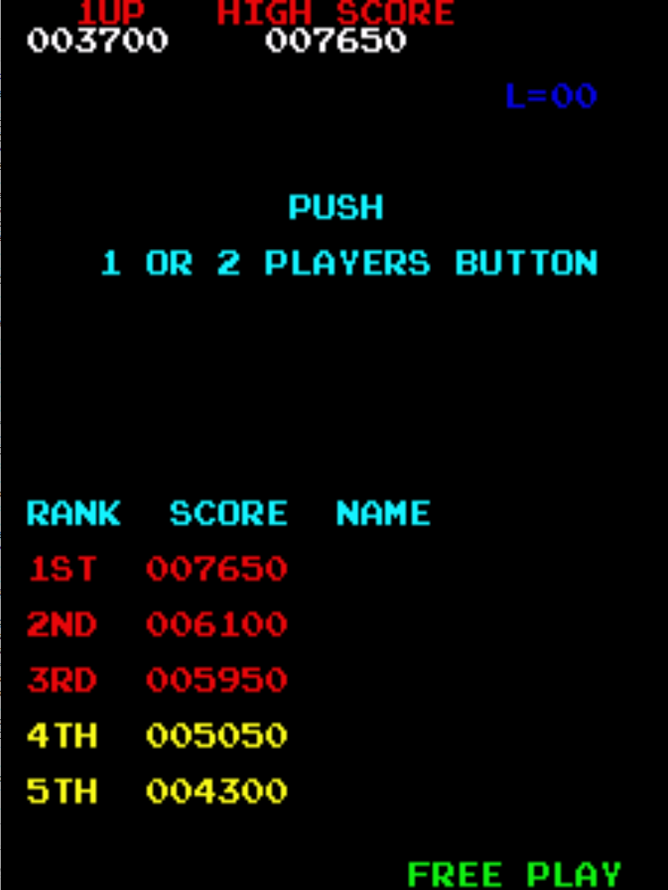

# Donkey Kong Freeplay
This is a mod to original US Set 1 and 2 revisions of the Donkey Kong ROMs that adds free play to the game. 

## Patch information
One patch file is provided for the *dkong* or *dkongo* ROM set as found in MAME. It has been tested for this ROM set only and may not work on other revisions of Donkey Kong. The patches are designed to be used with LunarIPS. 

### US Set 1 - dkong.zip
| **Patched ROM Name** | **Size** | **CRC-32 Checksum** | **IC Location TKG4/TKG3** |
|----------------------|----------|---------------------|---------------------------|
| c_5at_g.bin          |    4k    |       748227DC      |      5A/5K                |
| c_5et_g.bin          |    4k    |       057C0A97      |      5E/5F                |

### US Set 2 - dkongo.zip
This one is a bit weird, the ROM file names need to be translated. This is due to US Set 2 being more commonly found on the TKG3 4 board stacks. Refer to this table for patching the ROMs.
| **US Set 1 Name** | **US Set 2 Name** |
|-------------------|-------------------|
| c_5at_g.bin       | tkg3c.5k          |
| c_5bt_g.bin       | c_5h_b.bin        |
| c_5ct_g.bin       | c_5ct_g.bin       |
| c_5et_g.bin       | c_5f_b.bin        |

| **Patched ROM Name** | **Size** | **CRC-32 Checksum** | **IC Location TKG4/TKG3** |
|----------------------|----------|---------------------|---------------------------|
| tkg3c.5k             |    4k    |       98B9F4A7      |      5A/5K                |
| c_5f_b.bin           |    4k    |       FD43990D      |      5E/5F                |

## Modification Documentation
To Do

## Images
