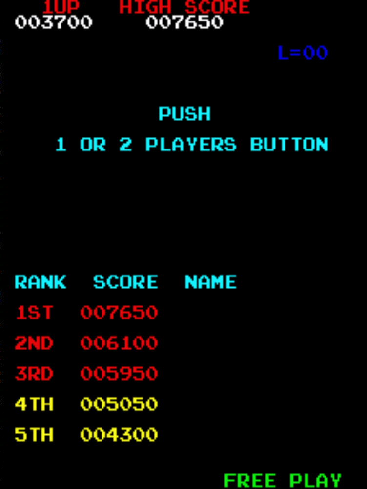

# Donkey Kong Freeplay
This is a mod to original US Set 1 revision of the Donkey Kong ROMs that adds free play to the game. 

## Patch information
One patch file is provided for the *dkong* ROM set as found in MAME. It has been tested for this ROM set only and may not work on other revisions of Donkey Kong. The patches are designed to be used with LunarIPS. 

| **Patched ROM Name** | **Size** | **CRC-32 Checksum** | **IC Location** |
|----------------------|----------|---------------------|-----------------|
| c_5at_g.bin          |    4k    |       748227DC      |        5A       |
| c_5et_g.bin          |    4k    |       057C0A97      |        5E       |

## Modification Documentation
To Do

## Images
