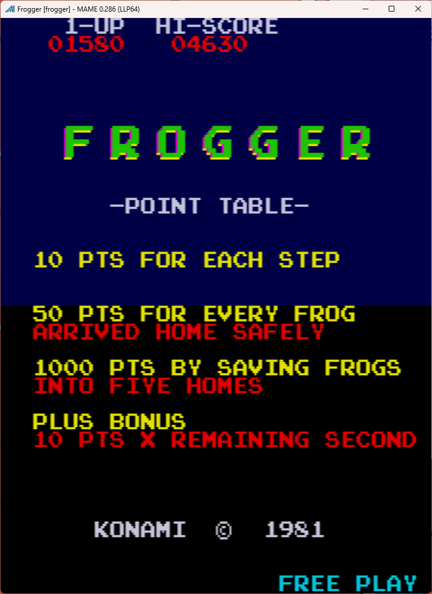
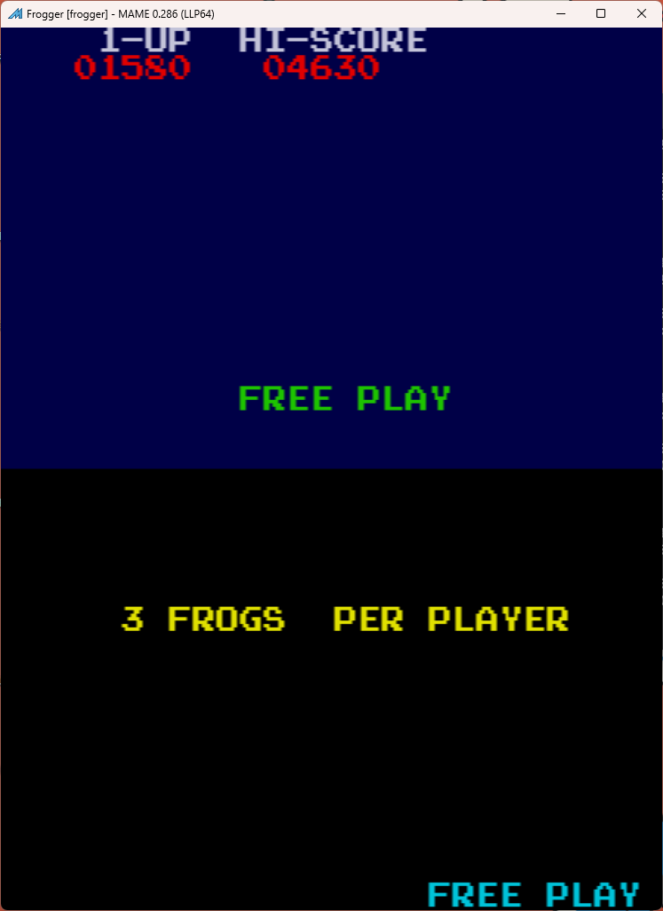

# Frogger Freeplay
This is a mod to original Konami and Sega Set 1 Frogger ROM set. 

## Patch information
Two patches are provided for the *frogger* or *froggers1* ROM set as found in MAME. It has been tested for this ROM set only and may not work on other revisions of Frogger. The patches are designed to be used with LunarIPS. 

### Konami Frogger (frogger.zip)
| **Patched ROM Name** | **Size** | **CRC-32 Checksum** | **IC Location** |
|----------------------|----------|---------------------|-----------------|
| frogger.26           |    4k    |       08458DAE      |       IC5       |
| frsm3.7              |    4k    |       7221DE54      |       IC7       |

### Sega Frogger Set 1 (froggers1.zip)
This one is a bit different with names, use the following translation:
| **File Name** | **Patch File** |
|---------------|----------------|
| epr-26.ic5    | frogger.26.ips |
| epr-34.ic7    | frsm3.7.ips    |

Alternatively, MAME had an alternative naming convention at some point:
| **File Name** | **Patch File** |
|---------------|----------------|
| frogger.26    | frogger.26.ips |
| frogger.34    | frsm3.7.ips    |

| **Patched ROM Name** | **Size** | **CRC-32 Checksum** | **IC Location** |
|----------------------|----------|---------------------|-----------------|
| epr-26.ic5           |    4k    |       08458DAE      |       IC5       |
| epr-34.ic7           |    4k    |       33059F1F      |       IC7       |

## Modification Documentation
To Do

## Images

