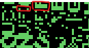

# Head On 2 (Slimline) Freeplay
This is a mod to original Head On 2 found in Sega Slimline and Nintendo Head On Part 2 machines. 

## Patch information
Three patches are provided for the *headon2sl* ROM set as found in MAME. It has been tested for this ROM set only and may not work on other revisions of Head On 2. The patches are designed to be used with LunarIPS. 


| **Patched ROM Name** | **Size** | **CRC-32 Checksum** | **IC Location** |
|----------------------|----------|---------------------|-----------------|
| epr-172.u31          |    1k    |       C443A99D      |       U31       |
| epr-172.u30          |    1k    |       23199BC1      |       U30       |
| epr-174.u29          |    1k    |       D8ACA980      |       U29       |
| epr-175.u28          |    1k    |       46408BD6      |       U28       |
| epr-177.u26          |    1k    |       38A1D95F      |       U26       |

## Modification Documentation
### CPU ROM Addresses
| **Location** | **Start Address** | **Size** | **Chip Type** |
|:------------:|:-----------------:|:--------:|:-------------:|
| U33          | 0x0000            | 1k       | 2708          |
| U32          | 0x0400            | 1k       | 2708          |
| U31          | 0x0800            | 1k       | 2708          |
| U30          | 0x0C00            | 1k       | 2708          |
| U29          | 0x1000            | 1k       | 2708          |
| U28          | 0x1400            | 1k       | 2708          |
| U27          | 0x1800            | 1k       | 2708          |
| U26          | 0x1C00            | 1k       | 2708          |

### ROM Changes
#### U31
There were two changes with this ROM:
- Value at $22F was changed from 0x0B to 0x09. This value is what defines how many characters are printed to screen during the printing of the "© Sega 1979". Since it was replaced with "Free Play" which is only 9 characters, this value had to be changed.
- The copyright protection was negated. Head On 2 (Slimline) had a ROM check that would occur every time a life was loaded. Meaning that every time you lost a life it would check the ROMs for tampering. This could be defeated by changing ld hl, 0x5FEA to ld hl, 0x0000 and replacing the sbc function with two nop instructions. This would always result in a pass. These changes were at $2D8 - $2DB

#### U30
The only change in this ROM was 4 bytes towards the beginning of ROM. This contained the character data to change the letter 'D' to an 'F'. Head On 2 did not have the letter 'F' programmed into the game, so this change was required.


#### U29
This is where the "press start" routine lived. It had to be converted to not loop and be periodically called. The jump instruction at $31E that was used to loop the routine had to be replaced with a return. The jump instruction at $326 had to be replaced with nop. The instruction that loads the decremented credit count at $329 was also replaced with nop.

#### U28
Only one instruction was changed here. The instruction at $30D that calls the routine to write "© Sega 1979" was changed to "Call $5FF0" which was a small routine that adds a call to check if the start button was pressed.

#### U26
Two things were changed. One the string "© Sega 1979" was changed to "Dree Play  " at $358. The reason for the 'D' in that string was because I had replaced the 'D' with 'F'. 

There was also a small routine added that basically added the call to check inputs. It is the only new routine that was added to this.
```z80asm
0x5FF0   Call  $4A2B     CD 2B 4A  //Write "Free Play" to the screen
0x5FF3   Call  $530E     CD 0E 53  //See if a start button was pressed          
0x5FF6   ret             C9        
```


## Images

