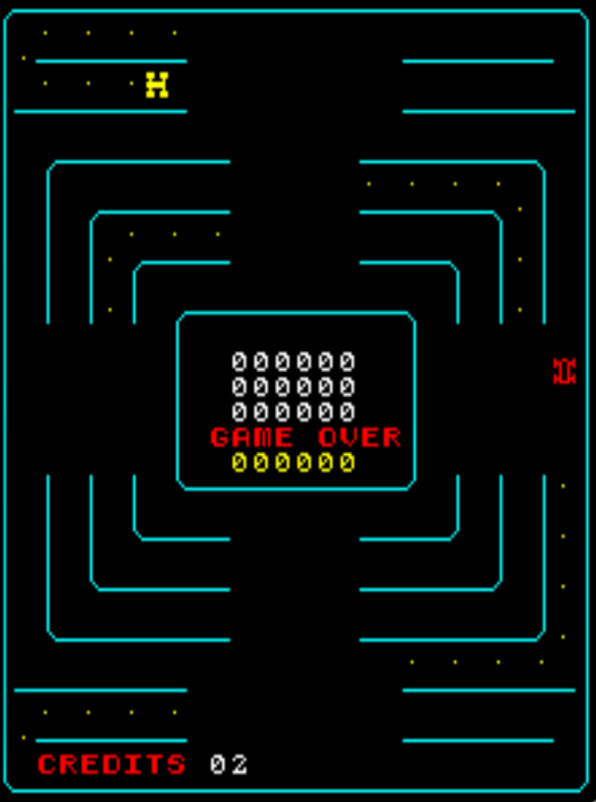

# Head On 2 (Slimline) Freeplay
This is a mod to original Head On 2 found in Sega Slimline and Nintendo Head On Part 2 machines. 

## Patch information
Three patches are provided for the *headon2sl* ROM set as found in MAME. It has been tested for this ROM set only and may not work on other revisions of Head On 2. The patches are designed to be used with LunarIPS. 

| **Patched ROM Name** | **Size** | **CRC-32 Checksum** | **IC Location** |
|----------------------|----------|---------------------|-----------------|
| epr-172.u31          |    1k    |       E58CF692      |       U31       |
| epr-174.u29          |    1k    |       D8ACA980      |       U29       |
| epr-175.u28          |    1k    |       46408BD6      |       U28       |
| epr-177.u26          |    1k    |       CBB5E312      |       U26       |

## Modification Documentation
To Do

## Images

