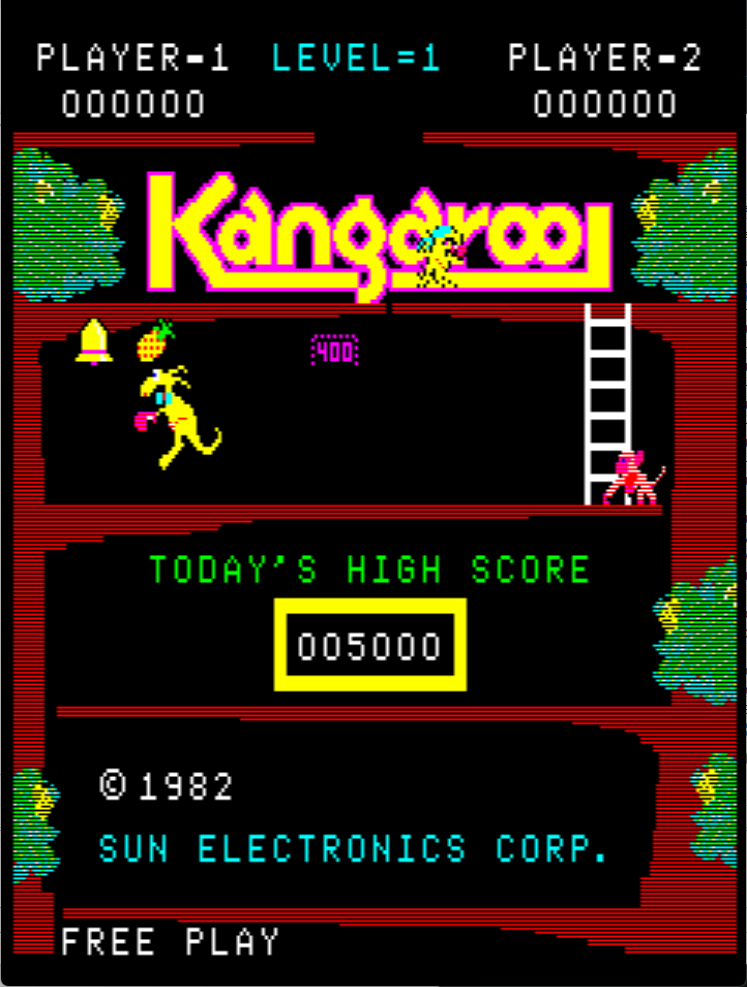
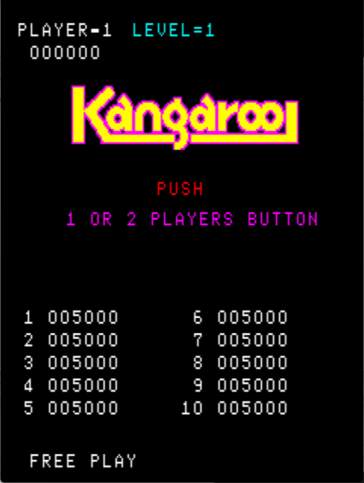

# Kangaroo Freeplay
This is an improved freeplay mod for Atari/Sun Electronics Kangaroo. It can be used with credits enabled as well as free play mode. These patches are meant to be used with LunarIPS or other similar patching utilities.

*Note that this removes the ROM check part of the self test.*

## Patch information
### Supported ROM Sets
| **ROM Set** | **MAME Working?** | **Machine Working?** |
|-------------|:-----------------:|:--------------------:|
| kangaroo    |        Yes        |       Untested       |
| kangarooa   |        Yes        |       Untested       |
| kangaroob   |        Yes        |       Untested       |
| kangarool   |        Yes        |       Untested       |

### kangaroo
| **Patched ROM Name** | **Size** | **CRC-32 Checksum** | **IC Location** |
|----------------------|----------|---------------------|-----------------|
| tvg_75.0             |    4k    |       77D6448B      |       ic7       |
| tvg_78.3             |    4k    |       07C366DB      |       ic10      |
| tvg_80.5             |    4k    |       541DE789      |       ic17      |

### kangarooa
| **Patched ROM Name** | **Size** | **CRC-32 Checksum** | **IC Location** |
|----------------------|----------|---------------------|-----------------|
| 136008-101.ic7       |    4k    |       77D6448B      |       ic7       |
| 136008-104.ic10      |    4k    |       07C366DB      |       ic10      |
| 136008-106.ic17      |    4k    |       EA8253FC      |       ic17      |

### kangaroob
| **Patched ROM Name** | **Size** | **CRC-32 Checksum** | **IC Location** |
|----------------------|----------|---------------------|-----------------|
| k1.ic7               |    4k    |       77D6448B      |       ic7       |
| k4.ic10              |    4k    |       07C366DB      |       ic10      |
| k6.ic17              |    4k    |       0D98378A      |       ic17      |

### kangarool
| **Patched ROM Name** | **Size** | **CRC-32 Checksum** | **IC Location** |
|----------------------|----------|---------------------|-----------------|
| tvg_75.ic7           |    4k    |       77D6448B      |       ic7       |
| tvg_78.ic10          |    4k    |       07C366DB      |       ic10      |
| tvg_80.ic17          |    4k    |       AD4B4A3E      |       ic17      |

## DIP Switch Setting
This is found on 8 position dip switch on the game PCB. It uses switches 5, 6, 7, and 8.

| **Coin/Credit** | **5** | **6** | **7** | **8** |
|----------------:|:-----:|:-----:|:-----:|:-----:|
|             1/1 | *Off* | *Off* | *Off* | *Off* |
|       Free Play |   On  |   On  |   On  |   On  |

## Modification Documentation
To Do

## Images

