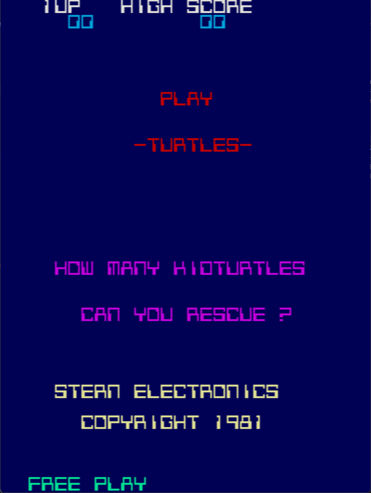

# Turtles Freeplay
This is a free play mod to original Turtles developed by Konami and released by Stern and Sega. The stern manual lists a free play mode for this, but it is a subpar implementation. It basically just sets the life count to 126 so that it plays "forever". This version just makes it free play.

## Patch information
### Supported ROM Sets
| **ROM Set** | **MAME Working?** | **Machine Working?** |
|-------------|:-----------------:|:--------------------:|
| turtles     |        Yes        |       Untested       |
| turpin      |        No         |          No          |
| 600         |        Yes        |       Untested       |

### Turtles (Stern License) - turtles.zip
| **Patched ROM Name** | **Size** | **CRC-32 Checksum** | **IC Location** |
|----------------------|----------|---------------------|-----------------|
| turt_vid.2c          |    4k    |       9EE3A97F      |       2C        |
| turt_vid.2e          |    4k    |       782399B2      |       2E        |

### 600 (Konami) - 600.zip
| **Patched ROM Name** | **Size** | **CRC-32 Checksum** | **IC Location** |
|----------------------|----------|---------------------|-----------------|
| turt_vid.2c          |    4k    |       EFEF8F78      |       2C        |
| turt_vid.2e          |    4k    |       0645AA8E      |       2E        |

## Modification Documentation
To Do

## Images

