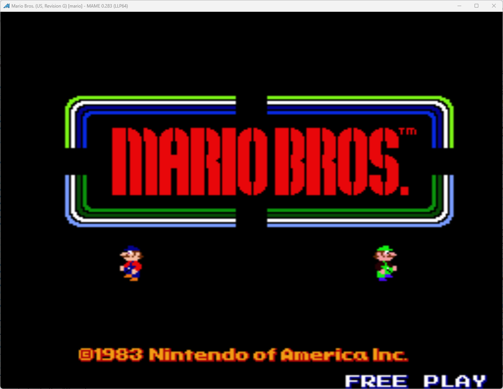

# Mario Bros Freeplay
This is a mod to original Mario Bros ROMs that moves the option of free play to the dip switches. It replaces the 1/3 option in the coin dip switch settings with free play. This is so that the game can boot to free play mode, eliminating the need to go into settings to enable free play.

*Note: The "Free Play" setting in the service menu will no longer work when the free play dip switches are set. It overrides the free play setting in memory*

## Patch information
Three patches are provided for the *mario* ROM set as found in MAME. It has been tested for this ROM set only and may not work on other revisions of Mario Bros. The patches are designed to be used with LunarIPS. 


| **Patched ROM Name** | **Size** | **CRC-32 Checksum** | **IC Location** |
|----------------------|----------|---------------------|-----------------|
| tma1-c-7d_g.7d       |    8k    |       242EAE3F      |        7D       |

## DIP Switch Setting
This is found on DPSW 1 on the game PCB. It uses switches C and D.

| **Coin/Credit** | **C** | **D** |
|----------------:|:-----:|:-----:|
|             2/1 |   On  |  Off  |
|             1/1 | *Off* | *Off* |
|             1/2 |  Off  |   On  |
|       Free Play |   On  |   On  |


## Modification Documentation
Most of the work is done by the game already. There is already a very good free play mode. So it is just making it so that it is a DIP switch option.

### Memory Values of Interest
- 0x6BF0: Free Play Setting
    - 0x01: Free Play Enabled
    - 0x00: Coin Operation
- 0x7F80: DIP Switch Settings
    - 0x0C: DIP Switch C and D

### Changed Source Code
This was really simple, it reads the free play setting at $4D27 normally, but I replace it with a routine to read the dip switches and write to $6BF0 (0x00 for coin play, 0x01 for Free Play). I replace some text that is not used or displayed in the game with the routine in question.

```z80asm
Addr     Instruction     Opcode
----------------------------------
0x4D27   Call 5FCD       CD CD 5F     //Check to see if the free play dip switches are enabled

0x5FCD   ld a, ($7F80)   3A 80 7F     //Read the dip switches
0x5FD0   and $0C         E6 0C        //Compare only switches C and D
0x5FD2   cp $0C          FE 0C        //Check to make sure both switches are flipped
0x5FD4   jr z, $5FDA     28 04        //If it isn't the right settings, load what is already in memory
0x5FD6   ld a, ($6BF0)   3A F0 6B     //Load the current free play setting
0x5FD9   ret             C9           //Return with the current free play setting
0x5FDA   ld a, $01       3E 01        //Load the write value
0x5FDC   ld ($6BF0), a   32 F0 6B     //Write the free play status
0x5FDF   ret             C9           //Returns with FP status in register a
```


## Images
