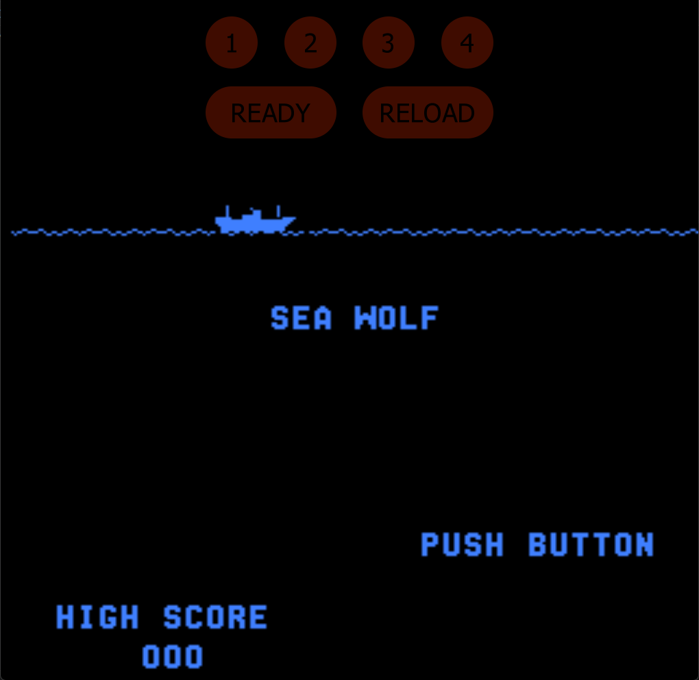

# Sea Wolf Freeplay
This is a mod to original Sea Wolf ROMs that adds free play to the game. 

## Patch information
### Supported ROM Sets
| **ROM Set** | **MAME Working?** | **Machine Working?** |
|-------------|:-----------------:|:--------------------:|
| seawolf     |        Yes        |       Untested       |
| seawolfo    |        No         |       Untested       |
| seawolfa    |        No         |       Untested       |

### seawolf
| **Patched ROM Name** | **Size** | **CRC-32 Checksum** | **IC Location** |
|----------------------|----------|---------------------|-----------------|
| sw0043.f             |    1k    |       0CDA9835      |        F        |
| sw0044.e             |    1k    |       86CCD743      |        E        |

## Modification Documentation
The modification is actually really simple. Sea Wolf attract mode will continue if there is a coin in. So the game just always needs to think that there is a coin. 

More documentation to do.

## Images
