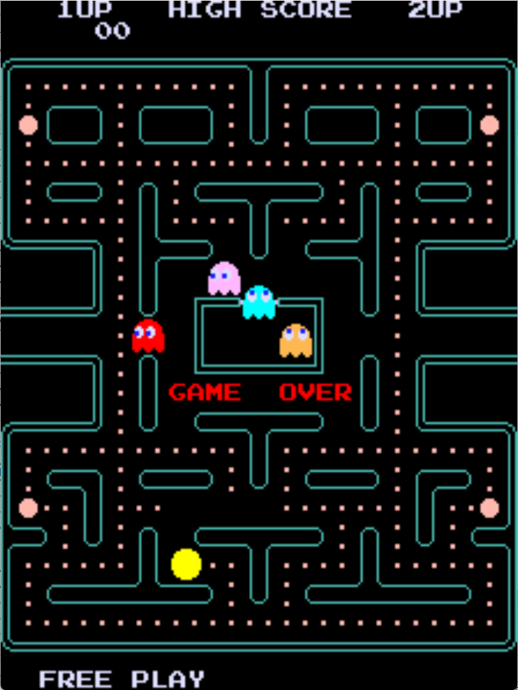

# Pacman Plus Freeplay
This is a mod to original Pacman Plus that adds free play with attract mode to the game. The default game has free play, but has a static screen. This free play mod was based on Scucci's (KLOV) free play mod for Pacman.

## Patch information
Patch files have been provided for both the encrypted and decrypted versions of Pacman Plus. The encrypted ROM set is to be used with a Pacman Plus board set with the security module. It also aligns with pacplus as found in MAME. The decrypted patches are for if the board is running a normal pacman board without the security module but the correct PROMs.

### Encrypted ROM Set
| **Patched ROM Name** | **Size** | **CRC-32 Checksum** | **IC Location** |
|----------------------|----------|---------------------|-----------------|
| pacplus.6e           |    4k    |       0B4EABE0      |        6E       |
| pacplus.6h           |    4k    |       F34100C1      |        6H       |

### Decrypted ROM Set
| **Patched ROM Name** | **Size** | **CRC-32 Checksum** | **IC Location** |
|----------------------|----------|---------------------|-----------------|
| pacplus_decrypted.6e |    4k    |       F11D8EE3      |        6E       |
| pacplus_decrypted.6h |    4k    |       A2BE5E91      |        6H       |

## Dip switches
This is found on DPSW 1 on the game PCB. It uses switches 1 and 2.

| **Coin/Credit** | **1** | **2** |
|----------------:|:-----:|:-----:|
|             2/1 |  Off  |  Off  |
|             1/1 | *Off* |  *On* |
|             1/2 |   On  |  Off  |
|       Free Play |   On  |   On  |

## Modification Documentation
### ROM Check
Pacman is interesting on how it actually does its ROM checks. It performs two checks per ROM. The first check validates all of the even bytes, the second check validates the odd bytes. The last two bytes per ROM are padding. The way the check works is that it adds up the bytes and sees if the 8 bit checksum is 0. It does such by adding each byte during each check.

The padding bytes have no impact on the code itself and can be changed in order to pass the ROM checks. xFFE is the padding for the even bytes. xFFF is the padding for the odd bytes. 

### Source
*to do*

## Images

