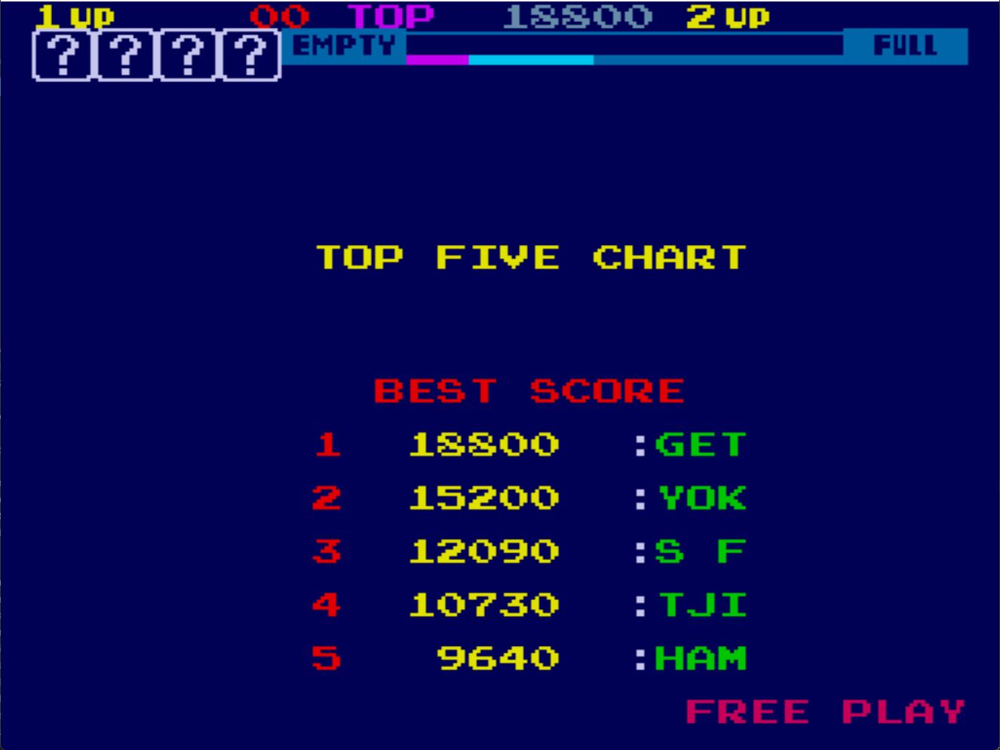

# Sky Skipper Freeplay
This is a mod to the original ROMs for Sky Skipper to add freeplay.

## Patch information
Three patch files are provided for the *skyskipr* ROM set as found in MAME. It has been tested for this ROM set only and will likely not work on other revisions of Sky Skipper (if there are others). The patches are designed to be used with LunarIPS. 


| **Patched ROM Name** | **Size** | **CRC-32 Checksum** | **IC Location** |
|----------------------|----------|---------------------|-----------------|
| tnx1-c.2a            |    4k    |       96A6030D      |        2A       |
| tnx1-c.2b            |    4k    |       19A3B422      |        2B       |
| tnx1-c.2d            |    4k    |       72F09728      |        2D       |

## Modification Documentation
### Noteworthy Variables in Memory
- Credit Count -> 8fda
- Game status -> 8ffc   80- 1p turn, 81-2pturn

**In 02**
- 0x04 - Player 1 Start
- 0x08 - Player 2 Start
- 0x10 - This bit alternates, not sure what this is for


### Added Routines
#### Clear All Credits
```Z80asm
Address  Instruction     Opcodes    Description
---------------------------------------------------------------------------
0x0E5A   sub a           97         //Load a for clearing the credits
0x0E7F   ld ($8FDA), a   32 DA 8F   //Clear the credits
0x0E82   ld hl, $3CF4    21 00 84   //Instruction from injected routine
0x0E85   ret             C9         //Check to see if anything is there
```

#### Freeplay Routine
```Z80asm
Address  Instruction     Opcodes    Description
---------------------------------------------------------------------------
0x0E62   in a($02)       DB 02      //Read switches
0x0E64   ld c,a          4F         //Store switch read for later
0x0E65   ld a, ($8FFC)   3A FC 8F   //Load the game state
0x0E68   and a           A7         //See if we are in a game mode
0x0E69   ld a,c          79         //Restore switches
0x0E6A   jr nz, $0E78    20 0C      //Jump to return area
0x0E6C   ld b, $0C       06 0C      //Start button masks
0x0E6E   and b           A0         //See if a start button was pressed
0x0E6F   jr z, $0E77     28 06      //return if no start button
0x0E71   ld ($8FDA), a   32 DA 8F   //Load which buttons were pressed for start routines
0x0E74   ld ($8FFC), a   32 FC 8F   //Populate the game mode
0x0E77   ld a,c          79         //Restore switches
0x0E78   ld b, 10        06 13      //bit 5 is occasionally used, so we should be having it there
0x0E7A   and b           A0         //clear the button presses
0x0E7B   add a, $C0      C6 C0      //Set the upper bits
0x0E7D   ret             C9         //return back to the coin routine
```

#### Clear Game State
```Z80asm
Address  Instruction     Opcodes    Description
---------------------------------------------------------------------------
0x0E7E   sub a           97         //Load a for clearing the state
0x0E7F   ld ($8FFC), a   32 FC 8F   //Clear the game stater later
0x0E82   ld hl, $8400    21 00 84   //Instruction from injected routine
0x0E85   ret             C9         //Check to see if anything is there
```

#### Print "Free Play"
```Z80asm
Address  Instruction     Opcodes    Description
---------------------------------------------------------------------------
0x0E8F   call $3F5B      CD 5B 3F  //Call substituted instruction
0x0E92   ld hl, $0E86    21 86 0E  //Load Freeplay string address
0x0E95   ld de, $A396    11 96 A3  //Load VRAM address
0x0E98   ld bc, $0009    01 09 00  //Load Counter for LDIR
0x0E9B   ldir            ED B0     //Print "Free Play"
0x0E9D   ld c, $09       0E 09     //Reset counter
0x0E9F   ld hl, $A796    21 96 A7  //Load color address
0x0EA2   ld (hl), $08    36 08     //Write the color (salmon)
0x0EA4   inc hl          23        //Load next color address location
0x0EA5   dec c           0D        //decrement the counter
0x0EA6   jr nz, $0EA2    20 FA     //Loop until we finish coloring the whole string
0x0EA8   ret             C9
```

#### Autostart Routine
```Z80asm
Address  Instruction     Opcodes    Description
---------------------------------------------------------------------------
0x0EB6   ld a, $8FDA      3A AF 8F  //Load coin count
0x0EB9   ld bc, $0100     01 00 01  //Load player 1 stuff
0x0EBC   bit 2,a          CB 57     //check for player 1 start
0x0EBE   jrnz $0ED5       20 15     //Jump to start routine
0x0EC0   ld bc, $0201     01 01 02  //Load player 2 stuff, if it isn't player 1 then just load p2
0x0EC3   jr  $0ED2        18 0D     //Jump to player 2 routine
```

### Injected Routines
- 0x0BD2: ld hl, $3CF4 -> call $0E5A
- 0x0BDB: call $3F5B -> call $0E8F
- 0x0DFC: in a, ($02) -> call $0E62
- 0x0E5D: call $34A5 -> jr $0EB6
- 0x0DFE: ld b, C0 -> nop
- 0x1024: ld hl, $8400 -> call $0E7E
- 0x3A60: ld ($8FDA), a -> nop (x3)

### Alphabet Character Translation
This is the characters I found for the video RAM section 0xA000 - 0xA3FF. This was used for the alphabet that I used. It is not a complete table of characters.
| **Letter** | **Hex** |
|------------|---------|
| A          | 0x0A    |
| B          | 0x0B    |
| C          | 0x0C    |
| D          | 0x0D    |
| E          | 0x0E    |
| F          | 0x0F    |
| G          | 0x10    |
| H          | 0x11    |
| I          | 0x12    |
| J          | 0x13    |
| K          | 0x14    |
| L          | 0x15    |
| M          | 0x16    |
| N          | 0x17    |
| O          | 0x18    |
| P          | 0x19    |
| Q          | 0x1A    |
| R          | 0x1B    |
| S          | 0x1C    |
| T          | 0x1D    |
| U          | 0x1E    |
| V          | 0x1F    |
| W          | 0x20    |
| X          | 0x21    |
| Y          | 0x22    |
| Z          | 0x23    |
| [Blank]    | 0xFF    |

Free play String:
```
0x0E86:   0F 1B 0E 0E FF 19 15 0A 22
```

### Color Palette Values
This one uses the lower 4 bits of the bytes. These values are used in the color RAM section of 0xA400 - 0xA7FF. The color is in reference to text printed, the pallet can have more than one color potentially. I am unsure exactly how it works, perhaps the upper bits are for a secondary color that isn't used by the text. It was only relevant for printing text on screen in this case.
| **Color** | **Hex**             |
|-----------|---------------------|
| 0x00      | Yellow              |
| 0x01      | Red                 |
| 0x02      | Pink                |
| 0x03      | Dark Gray           |
| 0x04      | Dark Blue           |
| 0x05      | Pink (Same as 2)    |
| 0x06      | Cyan                |
| 0x07      | Light Gray          |
| 0x08      | Salmon              |
| 0x09      | Yellow/Green        |
| 0x0A      | Mint                |
| 0x0B      | Yellow (Same as 0)  |
| 0x0C      | White               |
| 0x0D      | Blue                |
| 0x0E      | Green               |
| 0x0F      | Brown               |


## Images

