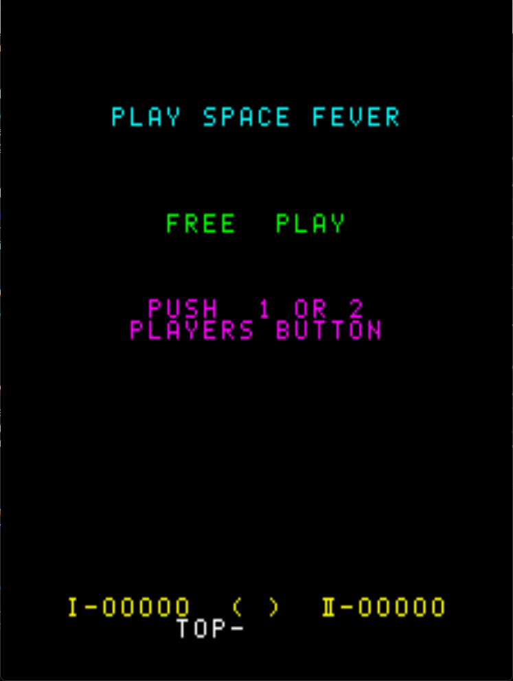

# Space Fever Freeplay
This is a mod for original Nintendo Space Fever ROMs that adds free play to the game. These patches are intended to be used with LunarIPS or similar patching utilities.

## Patch information
### Supported ROM Sets
| **ROM Set** | **MAME Working?** | **Machine Working?** |
|-------------|:-----------------:|:--------------------:|
| spacefev    |        Yes        |       Untested       |
| spacefevo   |        Yes        |       Untested       |
| spacefevo2  |        Yes        |       Untested       |

### spacefev
| **Patched ROM Name** | **Size** | **CRC-32 Checksum** | **IC Location** |
|----------------------|----------|---------------------|-----------------|
| f1-ro-.bin           |    1k    |       6AD69649      |       F1        |
| f2-ro-.bin           |    1k    |       BD310222      |       F2        |
| h1-ro-.bin           |    1k    |       486D4422      |       H1        |
| i1-ro-p.bin          |    1k    |       49C0299B      |       I1        |

### spacefevo
| **Patched ROM Name** | **Size** | **CRC-32 Checksum** | **IC Location** |
|----------------------|----------|---------------------|-----------------|
| f1-ro-.bin           |    1k    |       6AD69649      |       F1        |
| f2-ro-.bin           |    1k    |       BD310222      |       F2        |
| h1-ro-.bin           |    1k    |       486D4422      |       H1        |
| i1-ro-.bin           |    1k    |       3CA907FB      |       I1        |

### spacefevo2
| **Patched ROM Name** | **Size** | **CRC-32 Checksum** | **IC Location** |
|----------------------|----------|---------------------|-----------------|
| f1-i-.bin            |    1k    |       2087061C      |       F1        |
| f2-i-.bin            |    1k    |       CD4614C4      |       F2        |
| h1-i-.bin            |    1k    |       C0E68C88      |       H1        |
| i1-i-.bin            |    1k    |       7FDCFADC      |       I1        |

## Modification Documentation
### ROM Address Range
| **ROM** | **Start Address** | **Length** |
|:-------:|:-----------------:|:----------:|
|    F1   |       0x0000      |    0x400   |
|    F2   |       0x0400      |    0x400   |
|    G1   |       0x0800      |    0x400   |
|    G2   |       0x0C00      |    0x400   |
|    H1   |       0x1000      |    0x400   |
|    H2   |       0x1400      |    0x400   |
|    I1   |       0x1800      |    0x400   |

### Noteworthy Variables in Memory
#### Port 0
- IN0 - Start1 - 0x08
- IN0 - Start2 - 0x10
- IN0 - Coin - 0x80

#### Port 5
- OUT5 - Flip Screen - 0x20
    - Normal: Clear bit
    - Flipped Screen: Set bit

#### Memory Locations
- Coin Count: 0x60DB
- Coin switch held: 0x60DA
- Credit Screen: 0x6093
- In a game: 0x6094

### Added Routines
#### Free Play Routine
```8080asm
Address  Instruction       Opcodes    Description
---------------------------------------------------------------------------
//Button Handling
0x01D5   lxi h, $60DB      21 DB 60   //Load the credits count
0x01D8   mov a, m          7E         //The credits count doesn't get cleared until game over
0x01D9   ana a             A7         //If there are credits left, we are in game mode
0x01DA   jnz $0204         C2 04 02   //If we are in game mode, move on
0x01DD   in $00            DB 00      //Read the start button controls
0x01DF   ani $18           E6 18      //See if P1 or P2 was pressed
0x01E1   jz $0204          CA 04 02   //If not pressed, go back to normal operation
0x01E4   mov m, a          77         //Store the button press as credits
//Initialize the game
0x01E5   mvi a, $01        3E 01      //Select credit Mode 
0x01E7   sta $6093         32 93 60   //Store credit waiting buffer
0x01EA   out $04           D3 04      //Play credit sound
0x01EC   call $00DE        CD DE 00   //Clear the screen
0x01EF   lxi sp, $8000     31 00 80   //Reset the stack pointer
0x01F2   ei                FB         //Enable interrupts, the invaders won't load without it
0x01F3   xra a             AF         //Clear $60D9
0x01F4   sta $60D9         32 DB 60
0x01F7   out 5, a          D3 05      //Make sure the screen is right side up
0x01F9   jmp $13ED         C3 ED 13   //Jump to the autostart
```

#### Clear Credits (Game Mode)
```8080asm
Address  Instruction       Opcodes    Description
---------------------------------------------------------------------------
0x01FC   xra a             AF         //Clear credits         
0x01FD   sta $60DB         32 DB 60
0x0200   call $0E8E        CD 8E 0E   //From injected routine
0x0203   ret               C9         //Go back to game over routine
```

#### Modified Scoreboard Routine
This is an existing routine that has removed code. It was copied here to avoid having to have an additional ROM that needed modification.
```8080asm
Address  Instruction       Opcodes    Description
---------------------------------------------------------------------------
//Wrapper for scoreboard print
0x1A80   call $1AB0        CD B0 1A   //Call actual scoreboard routine
0x1A83   xra a             AF         //From injected routine
0x1A84   out $04           D3 04
0x1A86   ret               C9

//Scoreboard print routine
0x1AB0   call $0DC7        CD C7 0D   //Clear the screen
0x1AB0   call $0DD7        CD D7 0D   //Print header info
0x1AB0   call $0E0E        CD 0E 0E   //Print P1 Score
0x1AB0   call $0E14        CD 14 0E   //Print P2 Score
```

### Modified  Routines
#### Injected Routines
```
0x0719   call $0E8E -> call $01FC     //Clear credits
0x118C   call $1141 -> call $1A80     //
0x11A0   mvi c, $0C -> mvi c, $11     //Changed string length for "Play Space Fever"
0x11A2   lxi h, $4A18 -> lxi h, $481A //Changed start position (up and left)
0x11A5   lxi d, $1970 -> lxi d, $1a38 //Changed string to "Play Space Fever"
0x11A8   call $0D7A -> call $1A38     //Call new routine to print multiple strings
0x11AB   lxi h, $4813 -> lxi h, $4811 //move string down
0x1288   call $0E6C -> nop x3         //Removed "Credit 00" call
0x1306   call $0DA6 -> call $1AB0     //Call modified scoreboard print routine
```

#### Autostart
```8080asm
Address  Instruction       Opcodes    Description
---------------------------------------------------------------------------
0x13ED   lda $60DB         3A DB 60   //Load credit count
0x13F0   rlc               07         //Check if P2 was pressed
0x13F1   rlc               07
0x13F2   rlc               07
0x13F3   rlc               07
0x13F4   jc $13FD          DA FD 13   //Start P2 Game if P2 is pressed
0x13F7   jmp $1279         C3 79 12   //Otherwise start P1 game
```
### Character Table
Space Fever has a table for easy printing of characters. For this mod, some letters have been removed in order to either add extra strings or extra routines. These letters were not used with this free play mod and are never referenced. Each character takes up 8 bytes in memory. 

| **Index** | **Original Value** | **Modified Value** |
|-----------|:------------------:|:------------------:|
| 0x00      |          A         |          A         |
| 0x01      |          B         |          B         |
| 0x02      |          C         |          C         |
| 0x03      |          D         |          E         |
| 0x04      |          E         |          F         |
| 0x05      |          F         |          G         |
| 0x06      |          G         |          H         |
| 0x07      |          H         |     [*REMOVED*]    |
| 0x08      |          I         |     [*REMOVED*]    |
| 0x09      |          J         |     [*REMOVED*]    |
| 0x0A      |          K         |     [*REMOVED*]    |
| 0x0B      |          L         |          L         |
| 0x0C      |          M         |          M         |
| 0x0D      |          N         |          N         |
| 0x0E      |          O         |          O         |
| 0x0F      |          P         |          P         |
| 0x10      |          Q         |     [*REMOVED*]    |
| 0x11      |          R         |          R         |
| 0x12      |          S         |          S         |
| 0x13      |          T         |          T         |
| 0x14      |          U         |          U         |
| 0x15      |          V         |          V         |
| 0x16      |          W         |     [*REMOVED*]    |
| 0x17      |          X         |     [*REMOVED*]    |
| 0x18      |          Y         |          Y         |
| 0x19      |          Z         |          Z         |
| 0x1A      |          0         |          0         |
| 0x1B      |          1         |          1         |
| 0x1C      |          2         |          2         |
| 0x1D      |          3         |          3         |
| 0x1E      |          4         |          4         |
| 0x1F      |          5         |          5         |
| 0x20      |          6         |          6         |
| 0x21      |          7         |          7         |
| 0x22      |          8         |          8         |
| 0x23      |          9         |          9         |
| 0x24      |          (         |          (         |
| 0x25      |          )         |          )         |
| 0x26      |      [*SPACE*]     |      [*SPACE*]     |
| 0x27      |          I         |          I         |
| 0x28      |         II         |         II         |
| 0x29      |          -         |          -         |
| 0x2A      |          ?         |          ?         |

### New Strings
#### FREE  PLAY
```
0x1971
Original: 05 11 04 04 26 26 0F 0B 00 18
Modified: 04 11 03 03 26 26 0F 0B 00 18
```

#### PUSH  1 OR 2
```
0x1982
Original: 0F 14 12 07 26 26 1B 26 0E 11 26 1C
Modified: 0F 14 12 06 26 26 1B 26 0E 11 26 1C
```

#### PLAYERS BUTTON
```
0x1992
Original: 0F 0B 00 18 04 11 12 26 01 14 13 13 0E 0D
Modified: 0F 0B 00 18 03 11 12 26 01 14 13 13 0E 0D
```

#### PLAY SPACE FEVER
```
0x1A47
Original: 0F 0B 00 18 26 12 0F 00 02 04 26 05 04 15 04 11
Modified: 0F 0B 00 18 26 12 0F 00 02 03 26 04 03 15 03 11
```


## Images

