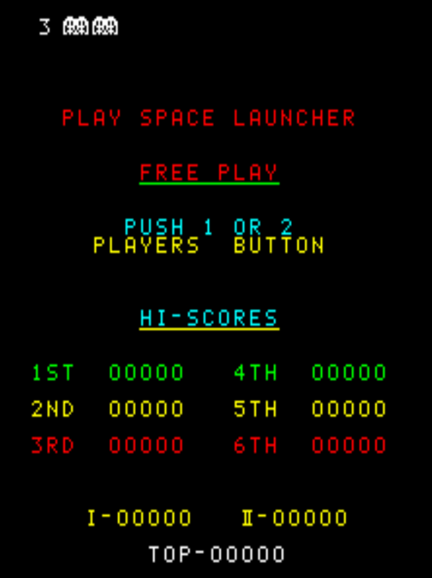

# Space Launcher Freeplay      
This is a mod for original Nintendo Space Launcher ROMs that adds free play to the game. These patches are intended to be used with LunarIPS or similar patching utilities.

## Patch information
### Supported ROM Sets
| **ROM Set** | **MAME Working?** | **Machine Working?** |
|-------------|:-----------------:|:--------------------:|
| spacelnc    |        Yes        |       Untested       |

### highsplt 
| **Patched ROM Name** | **Size** | **CRC-32 Checksum** | **IC Location** |
|----------------------|----------|---------------------|-----------------|
| sl.f1                |    1k    |       B91B3A62      |       F1        |
| sl.h1                |    1k    |       3ECB3C85      |       H1        |
| sl.i1                |    1k    |       76C817D9      |       I1        |
| sl.i2                |    1k    |       5FCEB312      |       I2        |

## Modification Documentation
To Do

## Images

