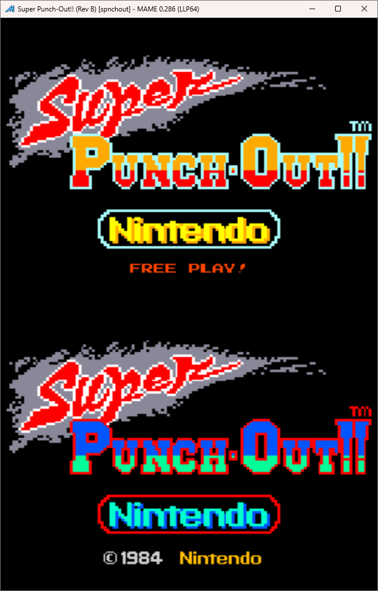
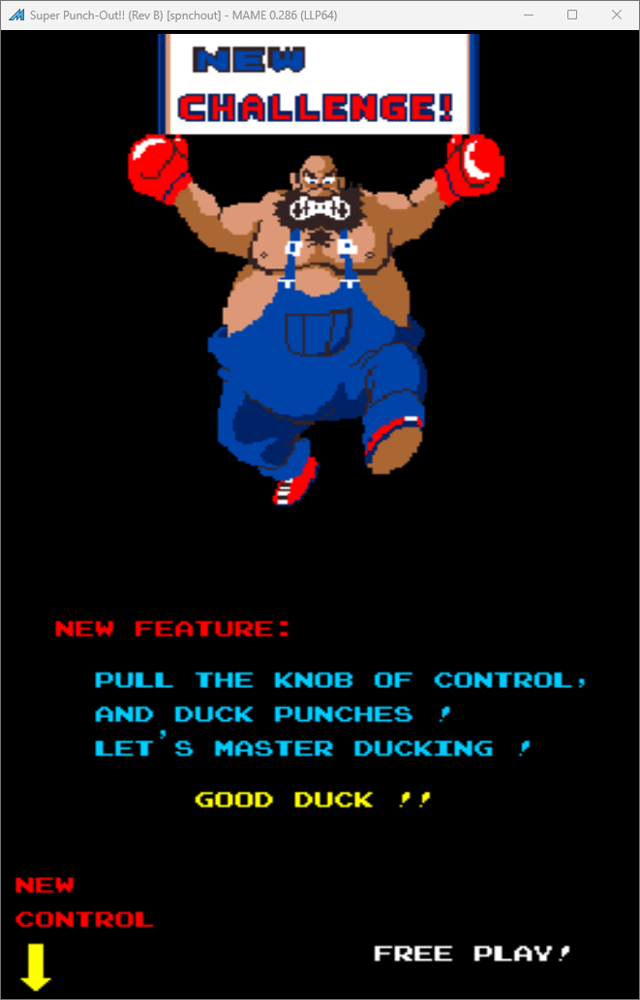
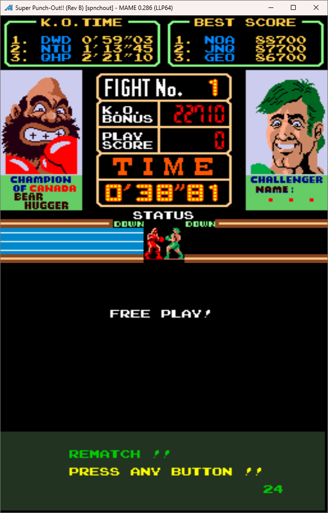

# Super Punch-Out!! Freeplay
This is a mod to original Super Punchout ROMs that adds free play to the game. 

This Free Play Mod is an enhancement of the one written by DogP on KLOV. This user wrote the initial free play ROM, what was added was wording to have the game reflect that it is free play. It adds "Free Play" to the title screen and changes the wording of the rematch screen.

## Patch information
### Freeplay
Two patch files are provided for the *spnchout* ROM set as found in MAME. It has been tested for this ROM set only and may not work on other revisions of Super Punch Out. The patches are designed to be used with LunarIPS. 

| **Patched ROM Name** | **Size** | **CRC-32 Checksum** | **IC Location** |
|----------------------|----------|---------------------|-----------------|
| chs1-c.8f            |   16k    |       B59E1FA8      |        8F       |
| chs1-c.8l            |    8k    |       923AA761      |        8L       |

## Modification Documentation
to do

## Images

