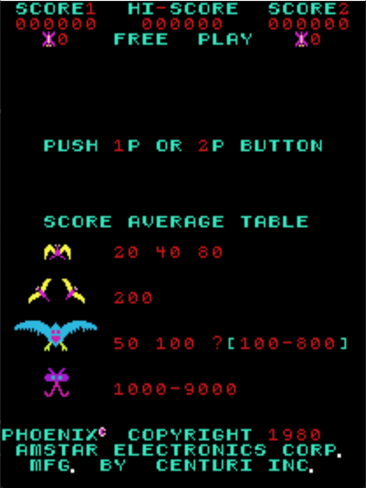

# Phoenix Freeplay
This is a freeplay mod for Amstar/Centuri Phoenix. There are an absurd amount of phoenix ROM sets, not all of them will be tested and supported.

## Patch information
### Supported ROM Sets
| **ROM Set** | **MAME Working?** | **Machine Working?** |
|-------------|:-----------------:|:--------------------:|
| phoenix     |        Yes        |         Untested     |
| phoenix2    |        Yes        |         Untested     |
| phoenix3    |        Yes        |         Untested     |
| phoenixa    |        Yes        |         Yes          |
| phoenixb    |        Yes        |         Yes          |
| phoenixc    |        Yes        |         Untested     |
| phoenixc2   |        Yes        |         Untested     |
| phoenixc3   |        Yes        |         Untested     |
| phoenixc4   |        Yes        |         Untested     |
| phoenixdal  |        Yes        |         Untested     |
| phoenixgu   |        Yes        |         Untested     |
| phoenixha   |        Yes        |         Untested     |
| phoenixi    |        Yes        |         Untested     |
| phoenixj    |        Yes        |         Untested     |
| phoenixt    |        Yes        |         Untested     |
| phoenixs    |        Yes        |         Untested     |
| fenixn      |        Yes        |         Untested     |

### Amstar Set 1 - phoenix 
| **Patched ROM Name** | **Size** | **CRC-32 Checksum** | **IC Location** |
|----------------------|----------|---------------------|-----------------|
| ic45                 |    2k    |       BF9EAA63      |    IC45/1A      |
| ic48                 |    2k    |       22DE742C      |    IC48/4A      |

### Amstar Set 2 - phoenix2 
| **Patched ROM Name** | **Size** | **CRC-32 Checksum** | **IC Location** |
|----------------------|----------|---------------------|-----------------|
| ic45-pg1.1a          |    2k    |       A6353943      |    IC45/1A      |
| ic48-pg4.4a          |    2k    |       22DE742C      |    IC48/4A      |

### T.P.N. - phoenix3
| **Patched ROM Name** | **Size** | **CRC-32 Checksum** | **IC Location** |
|----------------------|----------|---------------------|-----------------|
| phoenix3.45          |    2k    |       310391C5      |    IC45/1A      |
| phoenix3.48          |    2k    |       5C5A9774      |    IC48/4A      |

### Centuri Set 1 - phoenixa
| **Patched ROM Name** | **Size** | **CRC-32 Checksum** | **IC Location** |
|----------------------|----------|---------------------|-----------------|
| 1-ic45.1a            |    2k    |       957CADB5      |    IC45/1A      |
| 4-ic48.4a            |    2k    |       AF143208      |    IC48/4A      |

### Centuri Set 2 - phoenixb
| **Patched ROM Name** | **Size** | **CRC-32 Checksum** | **IC Location** |
|----------------------|----------|---------------------|-----------------|
| 1-ic45.1a            |    2k    |       957CADB5      |    IC45/1A      |
| 4-ic48.4a            |    2k    |       AF143208      |    IC48/4A      |

### Iresca / G.G.I. Corporation - phoenixc
| **Patched ROM Name** | **Size** | **CRC-32 Checksum** | **IC Location** |
|----------------------|----------|---------------------|-----------------|
| phoenix.45           |    2k    |       A6353943      |    IC45/1A      |
| phoenixc.48          |    2k    |       B3635F2C      |    IC48/4A      |

### G.G.I. Corporation Set 1 - phoenixc2
| **Patched ROM Name** | **Size** | **CRC-32 Checksum** | **IC Location** |
|----------------------|----------|---------------------|-----------------|
| phoenix.45           |    2k    |       A6353943      |    IC45/1A      |
| 01.ic48              |    2k    |       1B0DFBE1      |    IC48/4A      |

### G.G.I. Corporation Set 2 - phoenixc3
| **Patched ROM Name** | **Size** | **CRC-32 Checksum** | **IC Location** |
|----------------------|----------|---------------------|-----------------|
| phoenix.45           |    2k    |       A6353943      |    IC45/1A      |
| 4.a4                 |    2k    |       88D2A6D4      |    IC48/4A      |

### G.G.I. Corporation Set 3 - phoenixc4
| **Patched ROM Name** | **Size** | **CRC-32 Checksum** | **IC Location** |
|----------------------|----------|---------------------|-----------------|
| phoenix.45           |    2k    |       A6353943      |    IC45/1A      |
| phoenixd.48          |    2k    |       87D21D30      |    IC48/4A      |

### D&L - phoenixdal
| **Patched ROM Name** | **Size** | **CRC-32 Checksum** | **IC Location** |
|----------------------|----------|---------------------|-----------------|
| dal.a1               |    2k    |       A6353943      |    IC45/1A      |
| dal.a4               |    2k    |       CB089B94      |    IC48/4A      |

### G. Universal Video - phoenixgu
| **Patched ROM Name** | **Size** | **CRC-32 Checksum** | **IC Location** |
|----------------------|----------|---------------------|-----------------|
| 48.bin               |    2k    |       A6353943      |    IC45/1A      |
| phoenix.45           |    2k    |       9CE1D73F      |    IC48/4A      |

### Hellomat Automaten (German) - phoenixha
| **Patched ROM Name** | **Size** | **CRC-32 Checksum** | **IC Location** |
|----------------------|----------|---------------------|-----------------|
| ic45                 |    2k    |       A6353943      |    IC45/1A      |
| ic48                 |    2k    |       90B51914      |    IC48/4A      |

### IDI - phoenixi
| **Patched ROM Name** | **Size** | **CRC-32 Checksum** | **IC Location** |
|----------------------|----------|---------------------|-----------------|
| 0201.bin             |    2k    |       4CD42222      |    IC45/1A      |
| 0204.bin             |    2k    |       19613553      |    IC48/4A      |

### Taito Set (Japan) - phoenixj
| **Patched ROM Name** | **Size** | **CRC-32 Checksum** | **IC Location** |
|----------------------|----------|---------------------|-----------------|
| pn01.45              |    2k    |       A6353943      |    IC45/1A      |
| pn04.48              |    2k    |       34C21F12      |    IC48/4A      |

### Taito Set (World) - phoenixt
| **Patched ROM Name** | **Size** | **CRC-32 Checksum** | **IC Location** |
|----------------------|----------|---------------------|-----------------|
| phoenix.45           |    2k    |       A6353943      |    IC45/1A      |
| phoenix.48           |    2k    |       34C21F12      |    IC48/4A      |

### Sonic (Spanish Bootleg) - phoenixs
| **Patched ROM Name** | **Size** | **CRC-32 Checksum** | **IC Location** |
|----------------------|----------|---------------------|-----------------|
| ic45.1_a1            |    2k    |       A6353943      |    IC45/1A      |
| ic48.4_a4            |    2k    |       5CCBE8AD      |    IC48/4A      |

### Niemer Fenix (Spanish Bootleg) - fenixn
| **Patched ROM Name** | **Size** | **CRC-32 Checksum** | **IC Location** |
|----------------------|----------|---------------------|-----------------|
| ic45.1_a1            |    2k    |       D743E2C7      |    IC45/1A      |
| ic48.4_a4            |    2k    |       D1057E2D      |    IC48/4A      |

## Modification Documentation
To Do

## Images

