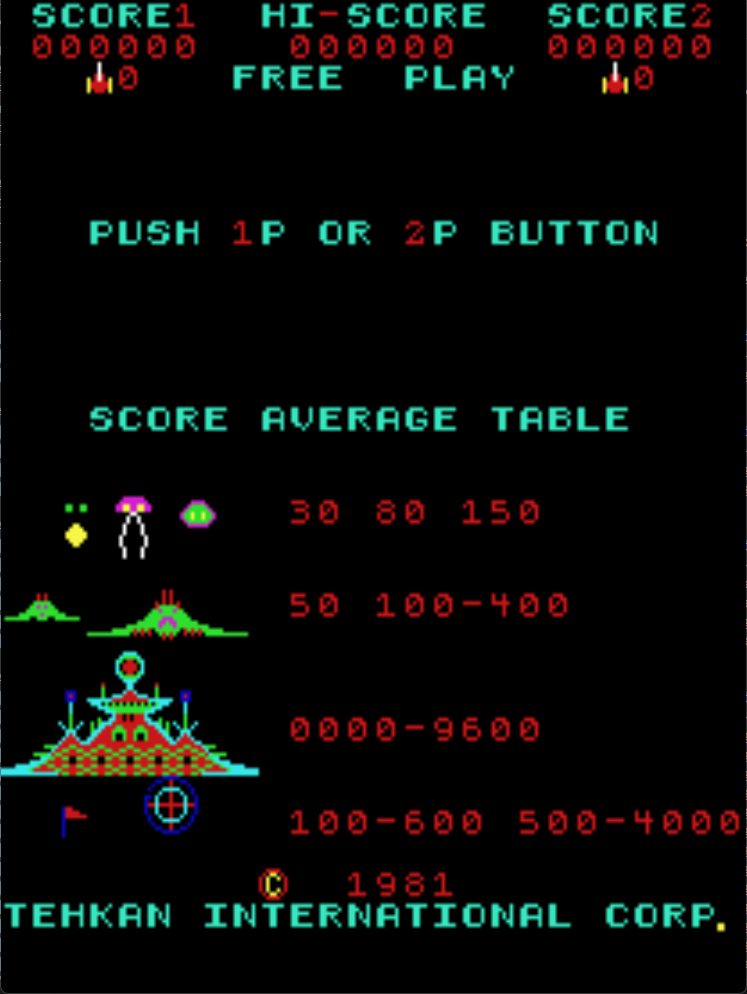

# Pleiades Freeplay
This is a freeplay mod for Pleiads. 

## Patch information
### Supported ROM Sets
| **ROM Set** | **MAME Working?** | **Machine Working?** |
|-------------|:-----------------:|:--------------------:|
| pleiads     |        Yes        |         Untested     |
| pleiadce    |        Yes        |         No           |
| pleiadsi    |        No         |         No           |
| pleiadsia   |        No         |         No           |

### Tehkan - pleiads  
| **Patched ROM Name** | **Size** | **CRC-32 Checksum** | **IC Location** |
|----------------------|----------|---------------------|-----------------|
| ic47.r1              |    2k    |       337486B6      |                 |
| ic48.bin             |    2k    |       C4D275E9      |                 |

### Tehkan (Centuri License) - pleiadce 
| **Patched ROM Name** | **Size** | **CRC-32 Checksum** | **IC Location** |
|----------------------|----------|---------------------|-----------------|
| pleiades.47          |    2k    |       CB8B910F      |                 |
| pleiades.50          |    2k    |       E2D24789      |                 |

### Tehkan (Irecsa License) Set 1 - pleiadsi 
| **Patched ROM Name** | **Size** | **CRC-32 Checksum** | **IC Location** |
|----------------------|----------|---------------------|-----------------|
| 1 2716.bin           |    2k    |       212B4CA8      |                 |
| 4 2716.bin           |    2k    |       725D5263      |                 |

## Modification Documentation
To Do

## Images

