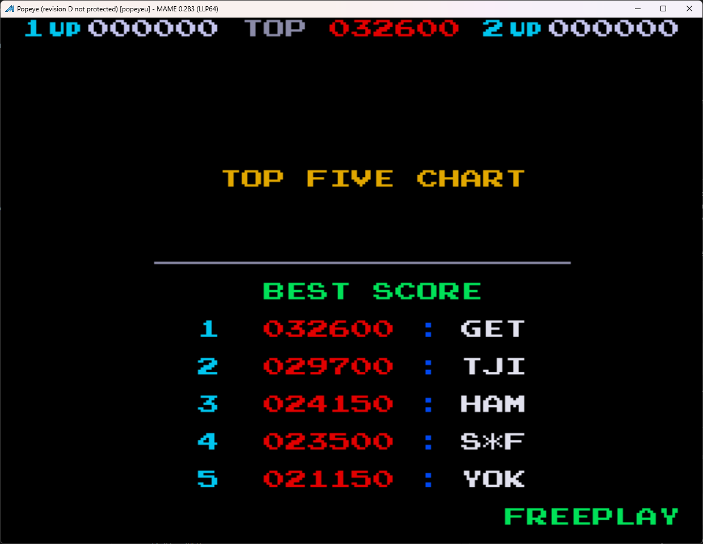

# Popeye Freeplay
This is a mod to original Unprotected D revision of the Popeye ROMs that adds free play with attract mode to the game. 

Note: This was tested on a Popeye PCB that did not hvae the security chip. This will likely not work on a board that contains the security chip.

## Patch information
One patch file is provided for the *popeyeu* ROM set as found in MAME. It has been tested for this ROM set only and will likely not work on other revisions of Popeye. The patches are designed to be used with LunarIPS. 


| **Patched ROM Name** | **Size** | **CRC-32 Checksum** | **IC Location** |
|----------------------|----------|---------------------|-----------------|
| 7a                   |    8k    |       CD77D98E      |        7A       |

## Modification Documentation
This is not a 100% complete documentation on what was done. A couple minor changes to call these routines are in the rom. This is more to provide source for the routines that were written for this mod.

### Noteworthy Variables in Memory
- Credit Count -> 8fdd
- Game status -> 8fff   80- 1p turn, 81-2pturn
- Added  Checksum padding value -> 10F3 - 69

**In 02**
- 0x04 - Player 1 Start
- 0x08 - Player 2 Start
- 0x10 - This bit alternates, not sure what this is for

### Source
#### Freeplay Coin Routine
```z80asm
0x1F1C in a($02)    DB 02      //Read switches
0x1F1E ld c,a       4f         //Store switch read for later
0x1F1F LD a,8FFF    3A FF 8F   //Load Gamestate
0x1F22 and a        A7         //Check to see if anything is there
0x1F23 ld a,c       79         //restore switch state
0x1F24 jrnz 9       20 09      //Jump to return area if game state is active
0x1F26 ld b,0C      06 0C      //Add 0x0C for comparing if a start button was pressed
0x1F28 and b        A0         //Check to see if anything is there
0x1F29 jrz 5        28 03      //If nothing was pressed, bail
0x1F2B LD (8FDD), a 32 DD 8F   //Else load coin button into coin count for later use
0x1F2E ld a,c       79         //Restore the switch state
0x1F2F ld b, 10     06 10      //bit 5 is occasionally used, so we should be having it there
0x1F31 and b        A0         //clear the button presses
0x1F32 ret          C9         //return back to the coin routine
```
#### Clear Coin Routine
```z80asm
0x1F33 ld a, 0      3E 00      //Clear A, this could have been accomplished with Sub A...
0x1F35 ld 8FDD,a    32 DD 8F   //Clear the coin count
0x1F38 Call 4c91    cd 91 4c   //Call the routine that was intercepted from
0x1F3B ret          c9         //Return back to the routine
```
#### Routine to write "Freeplay"
```z80asm
Inject the Freeplay call at 1C6F
1C6F = hl,$189D -> Call 1F3C
1C72 = Routine where "Top 5 Scores" gets written
1C57 = Routine where high scores get written

0x1F3C Ld hl, 1F38  21 55 1f      //Load the string address
0x1F3F Ld de, a397  11 97 a3      //Load vram address
0x1F42 Ld bc, a797  01 97 a7      //Load Color address
0x1F45 Ld a, (hl)   7E            //Load the next character
0x1F46 Cp ff        FE FF         //See if it is FF
0x1F48 jrz 06       28 06         //If it is FF, we are done, write the address and bail
0x1F4A Ld (de),a    12            //Write character to space
0x1F4B sub a        97            //Set color palette to 0x00 (light green)
0x1F4C Ld (bc),a    02            //Write the color palette
0x1F4D inc de       13            //Increment position counters
0x1F4E inc hl       23
0x1F4F inc bc       03
0x1F50 jr  89       18 F3         //Jump back to the start of the loop
0x1F52 Ld hl, $189D 21 9D 18      //Load back substituted instructions
0x1F54 ret          c9            //Return back to drawing routine
```
#### DMA Source RAM Clear
```z80asm
//DMA Source Clear Setup
0x1F5F sub a        97            //Clear the A Register
0x1F60 Ld hl, 8c00  21 00 8c      //Start Address for DMA Source
0x1F63 ld bc, 0370  01 70 03      //Counter for clearing
0x1F66 Call 10EA    CD EA 10      //Call the Clear Routine
0x1F69 - modified start routine   //Go to the start routine

//DMA Source Clear
0x10EA ld (hl),a    77            //Clear that spot in memory
0x10EB inc hl       23            //Increment the DMA Source Counter
0x10EC dec c        0D            //Decrement the least significant side of the counter
0x10ED jrnz FD      20 FB         //If the counter isn't zero, start again
0x10EF dec b        05            //Decrement the more significant side of the counter
0x10F0 jrnz FD      20 F8         //If the counter isn't zero, start again
0X10F2 ret          C9            //Return back to game start routine
```
### Added Strings
```
Freeplay String ($1F56) = 0F 1B 0E 0E 19 15 0A 22 FF
0xFF is the end byte
```

### Alphabet Character Translation
This is the characters I found for the video RAM section 0xA000 - 0xA3FF. This was used for the alphabet that I used. It is not a complete table of characters.
| **Letter** | **Hex** |
|------------|---------|
| A          | 0x0A    |
| B          | 0x0B    |
| C          | 0x0C    |
| D          | 0x0D    |
| E          | 0x0E    |
| F          | 0x0F    |
| G          | 0x10    |
| H          | 0x11    |
| I          | 0x12    |
| J          | 0x13    |
| K          | 0x14    |
| L          | 0x15    |
| M          | 0x16    |
| N          | 0x17    |
| O          | 0x18    |
| P          | 0x19    |
| Q          | 0x1A    |
| R          | 0x1B    |
| S          | 0x1C    |
| T          | 0x1D    |
| U          | 0x1E    |
| V          | 0x1F    |
| W          | 0x20    |
| X          | 0x21    |
| Y          | 0x22    |
| Z          | 0x23    |
### Color Palette Values
This one uses the lower 4 bits of the bytes. These values are used in the color RAM section of 0xA400 - 0xA7FF. The color is in reference to text printed, the pallet can have more than one color potentially. I am unsure exactly how it works. It was only relevant for printing text on screen in my case.
| **Color** | **Hex**             |
|-----------|---------------------|
| 0x00      | Light Green         |
| 0x01      | Cyan                |
| 0x02      | Light Gray          |
| 0x03      | Dark Gray           |
| 0x04      | Red                 |
| 0x05      | Dark Blue           |
| 0x06      | Orange              |
| 0x07      | Gray                |
| 0x08      | White               |
| 0x09      | Gold                |
| 0x0A      | Yellow              |
| 0x0B      | *This broke things* |
| 0x0C      | White               |
| 0x0D      | Tan                 |
| 0x0E      | Blue                |
| 0x0F      | Black               |

## Images

