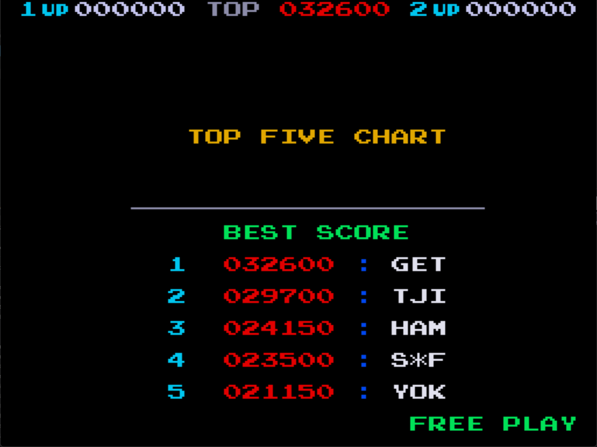

# Popeye Freeplay
This is a mod to original Unprotected D revision of the Popeye ROMs that adds free play with attract mode to the game. 

Note: This was tested on a Popeye PCB that did not hvae the security chip. This will likely not work on a board that contains the security chip.

## Patch information
One patch file is provided for the *popeyeu* ROM set as found in MAME. It has been tested for this ROM set only and will likely not work on other revisions of Popeye. The patches are designed to be used with LunarIPS. 

| **Patched ROM Name** | **Size** | **CRC-32 Checksum** | **IC Location** |
|----------------------|----------|---------------------|-----------------|
| 7a                   |    8k    |       CD77D98E      |        7A       |

## Modification Documentation
To Do

## Images

