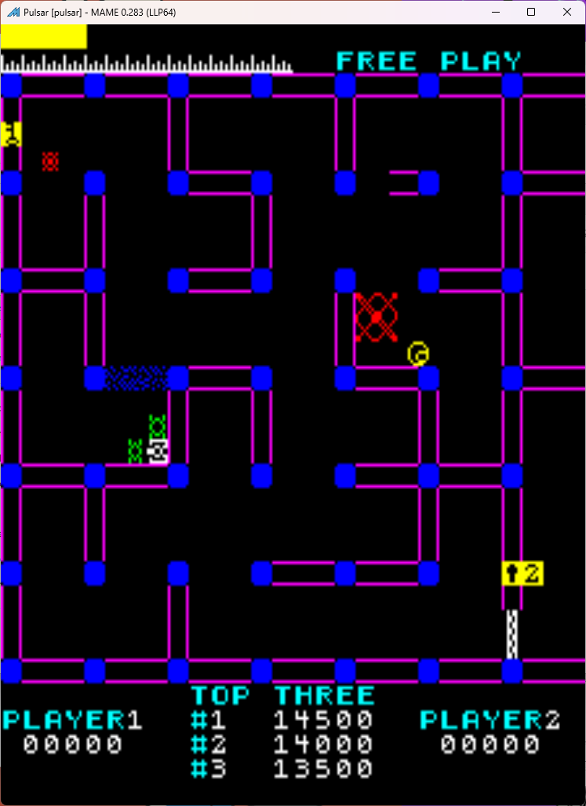
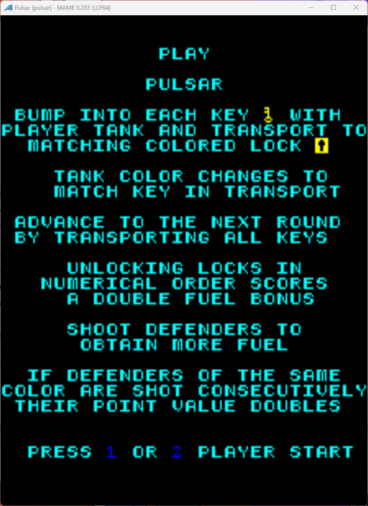

# Pulsar Freeplay
This is a mod to original Sega/Gremlin game *Pulsar*. This is currently untested for real machines but is working in MAME.

## Patch information
Three patches are provided for the *pulsar* ROM set as found in MAME. It has been tested for this ROM set only and may not work on other revisions of Pulsar. The patches are designed to be used with LunarIPS. 

| **Patched ROM Name** | **Size** | **CRC-32 Checksum** | **IC Location** |
|----------------------|----------|---------------------|-----------------|
| 790.u33              |    1k    |       0A6C2E04      |       U31       |
| 796.u27              |    1k    |       5D6B663A      |       U30       |
| 803.u3               |    1k    |       4932435F      |       U29       |
| 805.u1               |    1k    |       9B0D8E1F      |       U28       |

## Modification Documentation
### CPU ROM Addresses
| **Location** | **Start Address** | **Size** | **Chip Type** |
|:------------:|:-----------------:|:--------:|:-------------:|
| U33          | 0x0000            | 1k       | 2708          |
| U32          | 0x0400            | 1k       | 2708          |
| U31          | 0x0800            | 1k       | 2708          |
| U30          | 0x0C00            | 1k       | 2708          |
| U29          | 0x1000            | 1k       | 2708          |
| U28          | 0x1400            | 1k       | 2708          |
| U27          | 0x1800            | 1k       | 2708          |
| U26          | 0x1C00            | 1k       | 2708          |
| U8           | 0x2000            | 1k       | 2708          |
| U7           | 0x2400            | 1k       | 2708          |
| U6           | 0x2800            | 1k       | 2708          |
| U5           | 0x2C00            | 1k       | 2708          |
| U4           | 0x3000            | 1k       | 2708          |
| U3           | 0x3400            | 1k       | 2708          |
| U2           | 0x3800            | 1k       | 2708          |
| U1           | 0x3C00            | 1k       | 2708          |

### ROM Changes
To Do

## Images

