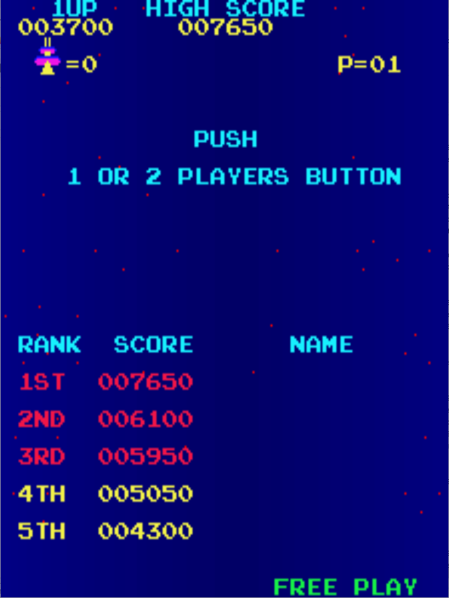

# Radar Scope Freeplay
This is a mod to original C and D revisions of the TRS2 Radar Scope ROMs that adds free play to the game. 

## Patch information
Two patch files are provided for the *radarscpc* and *radarscp* ROM sets as found in MAME. It may not work on TRS1 board sets

### TRS2 Revision C - radarscpc
| **Patched ROM Name** | **Size** | **CRC-32 Checksum** | **IC Location** |
|----------------------|----------|---------------------|-----------------|
| trs2c5fc             |    4k    |       0B4C782A      |        5F       |
| trs2c5hc             |    4k    |       5C4A71D5      |        5H       |

### TRS2 Revision D - radarscp
| **Patched ROM Name** | **Size** | **CRC-32 Checksum** | **IC Location** |
|----------------------|----------|---------------------|-----------------|
| trs2c5fd             |    4k    |       CB632D94      |        5F       |
| trs2c5hd             |    4k    |       EE5F15D1      |        5H       |

## Modification Documentation
To Do

## Images
