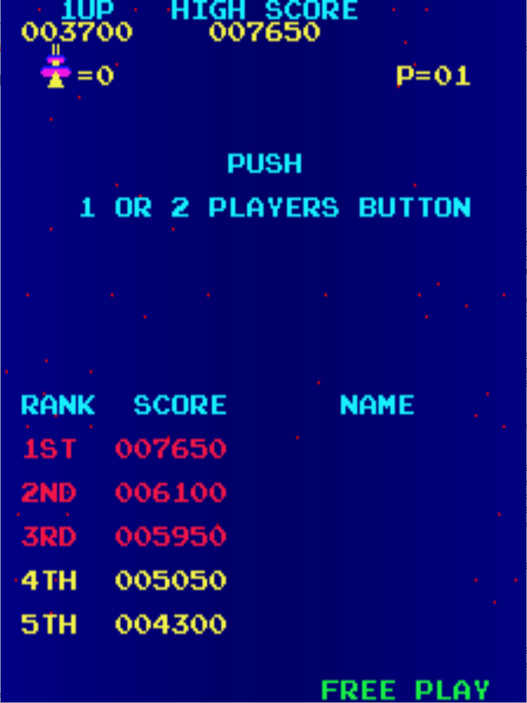

# Radar Scope Freeplay
This is a mod to original C revision of the TRS2 Radar Scope ROMs that adds free play to the game. 

## Patch information
Two patch files are provided for the *radarscpc* ROM set as found in MAME. It has been tested for this ROM set only and may not work on other revisions of Radar Scope. The patches are designed to be used with LunarIPS. 

| **Patched ROM Name** | **Size** | **CRC-32 Checksum** | **IC Location** |
|----------------------|----------|---------------------|-----------------|
| trs2c5fc             |    4k    |       0B4C782A      |        5F       |
| trs2c5hc             |    4k    |       6723587C      |        5H       |

## Modification Documentation
To Do

## Images
