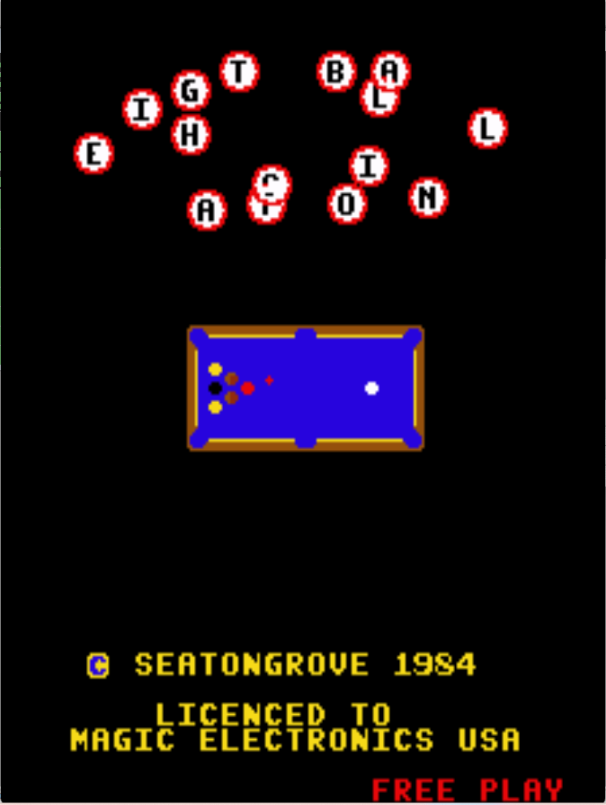

# 8 Ball Action Freeplay
This is a freeplay with attract mod for 8 Ball Action, a conversion kit for DK PCBs. These patches are meant to be used with LunarIPS or other similar patching utilities.

## Patch information
### Supported ROM Sets
| **ROM Set** | **MAME Working?** | **Machine Working?** |
|-------------|:-----------------:|:--------------------:|
| 8ballact    |        Yes        |       Untested       |
| 8ballact2   |        Yes        |       Untested       |

### 8ballact
| **Patched ROM Name** | **Size** | **CRC-32 Checksum** | **IC Location** |
|----------------------|----------|---------------------|-----------------|
| 8b-dk.5a             |    4k    |       54ADF9F4      |      5K/5A      |
| 8b-dk.5b             |    4k    |       DDD5CD3E      |      5H/5B      |
| 8b-dk.5c             |    4k    |       E190C1A2      |      5G/5C      |
| 8b-dk.5e             |    4k    |       5C1C5F21      |      5F/5E      |

### 8ballact2
| **Patched ROM Name** | **Size** | **CRC-32 Checksum** | **IC Location** |
|----------------------|----------|---------------------|-----------------|
| 8b-jr.5b             |    8k    |       BB85A999      |       5B        |
| 8b-jr.5c             |    8k    |       06E3FCC9      |       5C        |

## Modification Documentation
To Do

## Images

