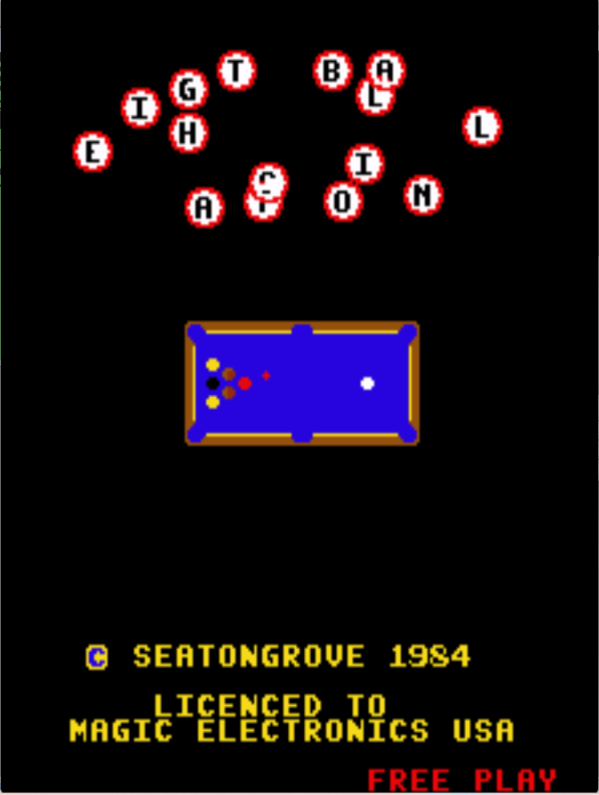

# 8 Ball Action Freeplay
This is a freeplay with attract mod for 8 Ball Action, a conversion kit for DK PCBs. These patches are meant to be used with LunarIPS or other similar patching utilities.

## Patch information
### Supported ROM Sets
| **ROM Set** | **MAME Working?** | **Machine Working?** |
|-------------|:-----------------:|:--------------------:|
| 8ballact    |        Yes        |       Untested       |
| 8ballact2   |        Yes        |       Untested       |

### 8ballact
| **Patched ROM Name** | **Size** | **CRC-32 Checksum** | **IC Location** |
|----------------------|----------|---------------------|-----------------|
| 8b-dk.5c             |    4k    |       CF25B46E      |      5G/5C      |

### 8ballact2
| **Patched ROM Name** | **Size** | **CRC-32 Checksum** | **IC Location** |
|----------------------|----------|---------------------|-----------------|
| 8b-jr.5c             |    8k    |       E34409F5      |       5C        |

## Modification Documentation
### Noteworthy Locations in Memory
$1D8B - Credit Count

### Modifications
The methodology for the 2650 DK Kit Mods is very straight forward:
- Instead of printing credit count, load 40 credits into the credit count variable
- Replace "Credit" text with "Free Play"

## Images

