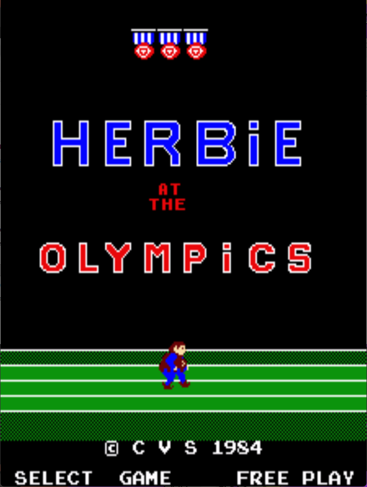

# Herbie at the Olympics Freeplay
This is a freeplay with attract mod for Herbie at the Olympics, a conversion kit for DK PCBs. These patches are meant to be used with LunarIPS or other similar patching utilities.

## Patch information
### Supported ROM Sets
| **ROM Set** | **MAME Working?** | **Machine Working?** |
|-------------|:-----------------:|:--------------------:|
| herbiedk    |        Yes        |       Untested       |

### herbiedk
| **Patched ROM Name** | **Size** | **CRC-32 Checksum** | **IC Location** |
|----------------------|----------|---------------------|-----------------|
| 5k.cpu               |    4k    |       B1DCDE43      |      5K/5A      |
| 5h.cpu               |    4k    |       3AA0DC49      |      5H/5B      |
| 5g.cpu               |    4k    |       9673648E      |      5G/5C      |
| 5f.cpu               |    4k    |       3E296CFB      |      5F/5E      |

## Modification Documentation
### Noteworthy Locations in Memory
$1C55 - Coin Switch Mirror
$1E50 - Credit Count

### Modifications
The methodology for the 2650 DK Kit Mods is very straight forward:
- Return instead of printing the credit digits
- Replace any load of the credit count with an immediate load of $99
- Replace "Credit" text with "Free Play"

## Images

