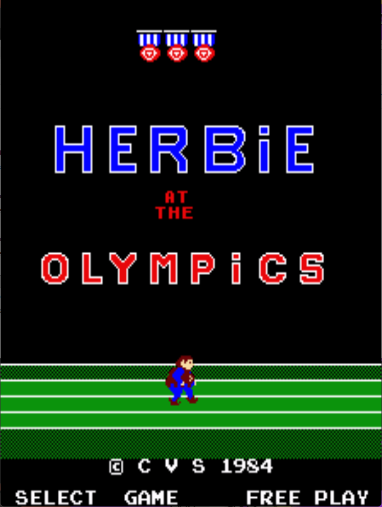

# Herbie at the Olympics Freeplay
This is a freeplay with attract mod for Herbie at the Olympics, a conversion kit for DK PCBs. These patches are meant to be used with LunarIPS or other similar patching utilities.

## Patch information
### Supported ROM Sets
| **ROM Set** | **MAME Working?** | **Machine Working?** |
|-------------|:-----------------:|:--------------------:|
| herbiedk    |        Yes        |       Untested       |

### herbiedk
| **Patched ROM Name** | **Size** | **CRC-32 Checksum** | **IC Location** |
|----------------------|----------|---------------------|-----------------|
| 5g.cpu               |    4k    |       97DFB8E2      |      5G/5C      |

## Modification Documentation
### Noteworthy Locations in Memory
$1C55 - Coin Switch Mirror
$1E50 - Credit Count

### Modifications
The methodology for the 2650 DK Kit Mods is very straight forward:
- Instead of printing credit count, load 40 credits into the credit count variable
- Replace "Credit" text with "Free Play"

## Images

