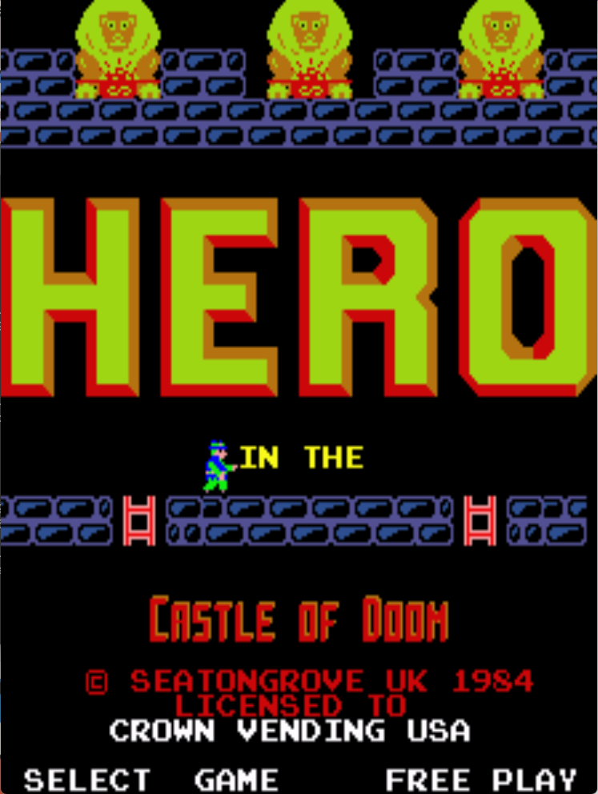

# Hero in the Castle of Doom Freeplay
This is a freeplay with attract mod for Hero in the Castle of Doom, a conversion kit for DK PCBs. These patches are meant to be used with LunarIPS or other similar patching utilities.

## Patch information
### Supported ROM Sets
| **ROM Set** | **MAME Working?** | **Machine Working?** |
|-------------|:-----------------:|:--------------------:|
| herodk      |        Yes        |       Untested       |
| herodku     |        Yes        |       Untested       |

### herodk  - Encrypted Set
| **Patched ROM Name** | **Size** | **CRC-32 Checksum** | **IC Location** |
|----------------------|----------|---------------------|-----------------|
| red-dot.rgt          |    8k    |       7E8C7B89      |       8H        |
| wht-dot.lft          |    8k    |       17A258A7      |       8F        |

### herodku - Unprotected Set
| **Patched ROM Name** | **Size** | **CRC-32 Checksum** | **IC Location** |
|----------------------|----------|---------------------|-----------------|
| 2764.8h              |    8k    |       B156BC82      |       8H        |
| 2764.8f              |    8k    |       70251F39      |       8F        |

## Modification Documentation
To Do

## Images

