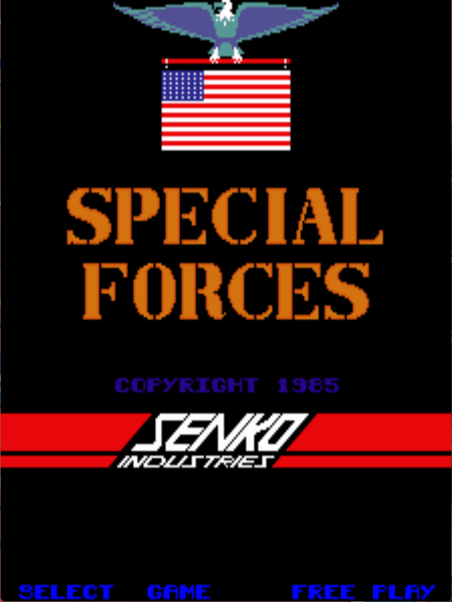
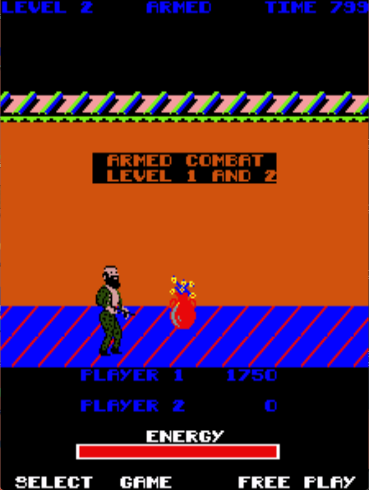

# Special Forces: Kung Fu Commando Freeplay
This is a freeplay with attract mod for Special Forces: Kung Fu Commando, a conversion kit for DK PCBs. These patches are meant to be used with LunarIPS or other similar patching utilities.

## Patch information
### Supported ROM Sets
| **ROM Set** | **MAME Working?** | **Machine Working?** |
|-------------|:-----------------:|:--------------------:|
| spclforc    |        Yes        |       Untested       |

### kangaroo
| **Patched ROM Name** | **Size** | **CRC-32 Checksum** | **IC Location** |
|----------------------|----------|---------------------|-----------------|
| 27128.8f             |   16k    |       DE0397BC      |       8f        |

## Modification Documentation
To Do

## Images

