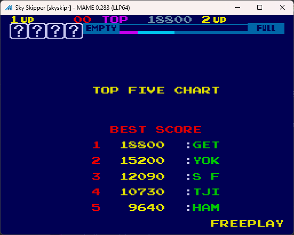

# Sky Skipper Freeplay
This is a mod to the original ROMs for Sky Skipper to add freeplay.

Note, this has not been tested on real hardware so it might not function. It has been tested and is working in MAME

## Patch information
One patch file is provided for the *skyskipr* ROM set as found in MAME. It has been tested for this ROM set only and will likely not work on other revisions of Popeye. The patches are designed to be used with LunarIPS. 

| **Patched ROM Name** | **Size** | **CRC-32 Checksum** | **IC Location** |
|----------------------|----------|---------------------|-----------------|
| tnx1-c.2a            |    8k    |       0123F9E7      |        2A       |
| tnx1-c.2b            |    8k    |       19A3B422      |        2B       |
| tnx1-c.2d            |    8k    |       72F09728      |        2D       |

## Modification Documentation
To Do

## Images
