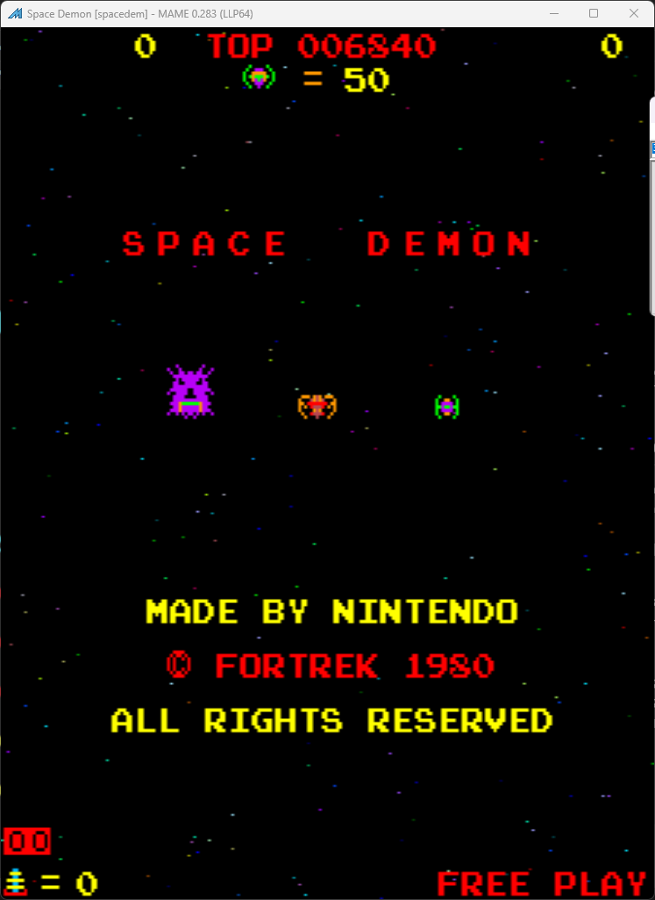

# Space Demon Freeplay
This is a mod for original Space Demon ROMs that adds free play to the game.

Special thanks to **philmurr** on KLOV for assistance in bypassing the nasty ROM check that occurs on startup. This check makes the game unplayable if it detects any changes as a form of protection. I also used a slightly modified version of his code from his Space Firebird mod to print "Free Play" over the credit count.

*Note: This is an unfinished mod. There is still the matter of keeping it from printing "Press to Start" text when starting a game. It only does it for a breif second but I would like to patch that out. This works fine otherwise.*

## Patch information
One patch file is provided for the *spacedem* ROM set as found in MAME. It has been tested for this ROM set only and may not work on other revisions of Space Demon if there are other undumped revisions of the game.

| **Patched ROM Name** | **Size** | **CRC-32 Checksum** | **IC Location** |
|----------------------|----------|---------------------|-----------------|
| sdm-c-5e             |    2k    |       5BA87A7A      |        5E       |
| sdm-c-5f             |    2k    |       0E1D518A      |        5F       |
| smd-c-5n             |    2k    |       548C67E7      |        5N       |

## Modification Documentation
### Address Ranges
```
0000-3FFF ROM       Code
8000-83FF RAM       Sprite RAM
C000-C7FF RAM       Game RAM
```
### Noteworthy Variables in Memory
- Credit count -> C0FF
- Game status? -> C0DA 
- 1P lives -> C002
- Number of enemy ships left ->C003

To Do - finish documentation

## Images
