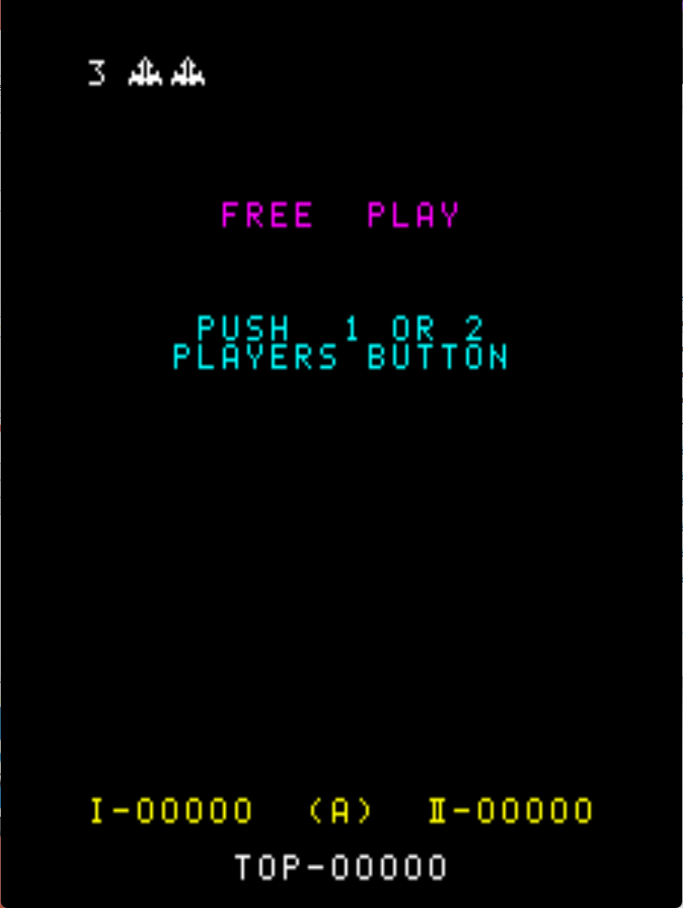

# Space Fever Freeplay
This is a mod for original Nintendo Space Fever ROMs that adds free play to the game.

## Patch information
### Supported ROM Sets
| **ROM Set** | **MAME Working?** | **Machine Working?** |
|-------------|:-----------------:|:--------------------:|
| spaceFev    |        Yes        |       Untested       |
| spacefevo   |        Yes        |       Untested       |
| spacefevo2  |        Yes        |       Untested       |

### spacefev
| **Patched ROM Name** | **Size** | **CRC-32 Checksum** | **IC Location** |
|----------------------|----------|---------------------|-----------------|
| f1-ro-.bin           |    1k    |       FFCAFC16      |       F1        |
| f2-ro-.bin           |    1k    |       70209DA3      |       F2        |
| h1-ro-.bin           |    1k    |       197679A8      |       H1        |
| i1-ro-p.bin          |    1k    |       B85F9842      |       I1        |

### spacefevo
| **Patched ROM Name** | **Size** | **CRC-32 Checksum** | **IC Location** |
|----------------------|----------|---------------------|-----------------|
| f1-ro-.bin           |    1k    |       FFCAFC16      |       F1        |
| f2-ro-.bin           |    1k    |       70209DA3      |       F2        |
| h1-ro-.bin           |    1k    |       197679A8      |       H1        |
| i1-ro-.bin           |    1k    |       CD36B622      |       I1        |

### spacefevo2
| **Patched ROM Name** | **Size** | **CRC-32 Checksum** | **IC Location** |
|----------------------|----------|---------------------|-----------------|
| f1-ro-.bin           |    1k    |       B59B6C43      |       F1        |
| f2-ro-.bin           |    1k    |       00578B45      |       F2        |
| h1-ro-.bin           |    1k    |       91FDB102      |       H1        |
| i1-ro-.bin           |    1k    |       8E434B05      |       I1        |

## Modification Documentation
To Do

### Noteworthy Variables in Memory
To Do

## Images

