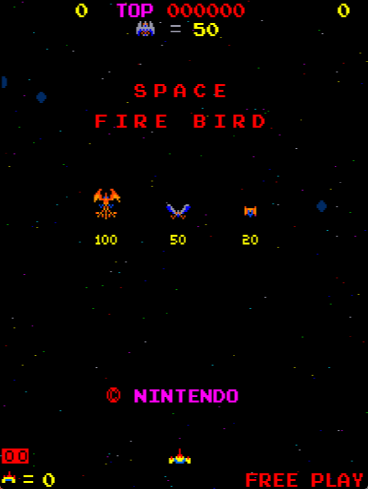

# Space Firebird Freeplay
This is a mod for original Nintendo Space Firebird ROMs that adds free play to the game.

Special thanks to **philmurr** on KLOV for assistance in bypassing the nasty ROM check that occurs on startup. This check makes the game unplayable if it detects any changes as a form of protection. I also used a slightly modified version of his code from his Space Firebird mod to print "Free Play" over the credit count.

## Patch information
Three patch files are provided for the *spacefb* ROM set as found in MAME. It has been tested for this ROM set only and may not work on other revisions of Space Firebird.

### spacefb
| **Patched ROM Name** | **Size** | **CRC-32 Checksum** | **IC Location** |
|----------------------|----------|---------------------|-----------------|
| tst-c-u.5e           |    2k    |       12FCC868      |        5E       |
| tst-c-u.5f           |    2k    |       D9B45D61      |        5F       |
| tst-c-u.5n           |    2k    |       E3270E22      |        5N       |

### spacefbe
| **Patched ROM Name** | **Size** | **CRC-32 Checksum** | **IC Location** |
|----------------------|----------|---------------------|-----------------|
| tst-c-e.5e           |    2k    |       1CE23A4D      |        5E       |
| tst-c-e.5f           |    2k    |       2ED46A89      |        5F       |
| tst-c-e.5n           |    2k    |       5372557B      |        5N       |

### spacefbe2
| **Patched ROM Name** | **Size** | **CRC-32 Checksum** | **IC Location** |
|----------------------|----------|---------------------|-----------------|
| 5e.cpu               |    2k    |       467FFC6E      |        5E       |
| tst-c-e.5f           |    2k    |       2ED46A89      |        5F       |
| tst-c-e.5n           |    2k    |       5372557B      |        5N       |

## Modification Documentation
### Address Ranges
```
0000-3FFF ROM       Code
8000-83FF RAM       Sprite RAM
C000-C7FF RAM       Game RAM
```

### Noteworthy Variables in Memory
- Credit count -> C0FF
- Game status -> C7FF


To Do - finish documentation

## Images

