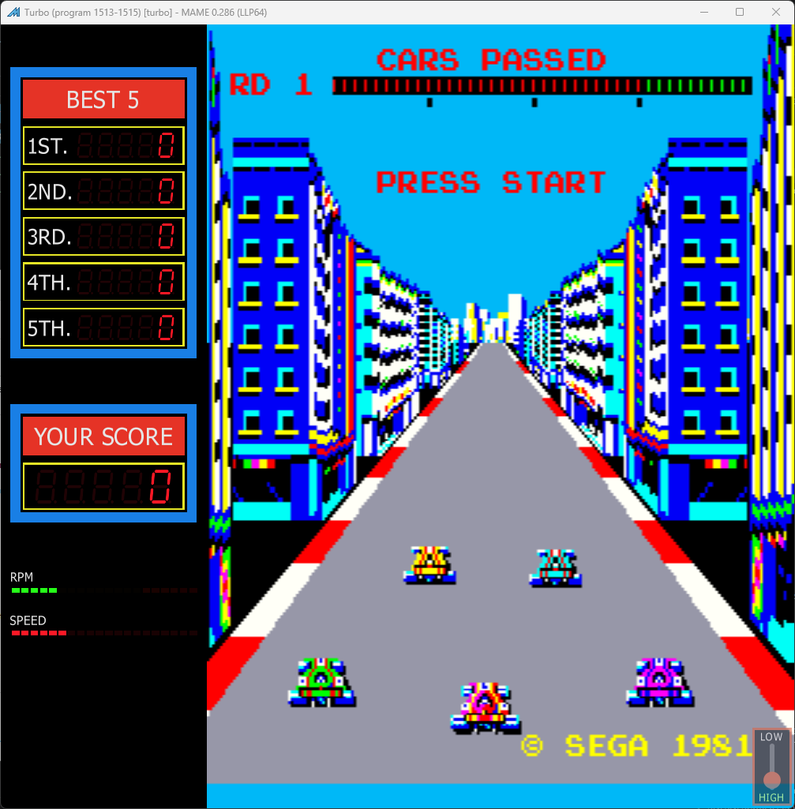

# Turbo Freeplay
This is a mod to original Sega Turbo ROMs that adds free play to the game. 

This patch was originally written by Steven McLeod. Updates were added to correct the checksum for test mode and have it auto start so that the start button only has to be pressed once.

## Patch information
One patch are provided for the *turbo* ROM set as found in MAME. It has been tested for this ROM set only and may not work on other revisions of Turbo. The patches are designed to be used with LunarIPS. 

| **Patched ROM Name** | **Size** | **CRC-32 Checksum** | **IC Location** |
|----------------------|----------|---------------------|-----------------|
| epr-1513.cpu-ic76    |    8k    |       B2CA93EC      |       IC76      |

## Modification Documentation
To Do

## Images

