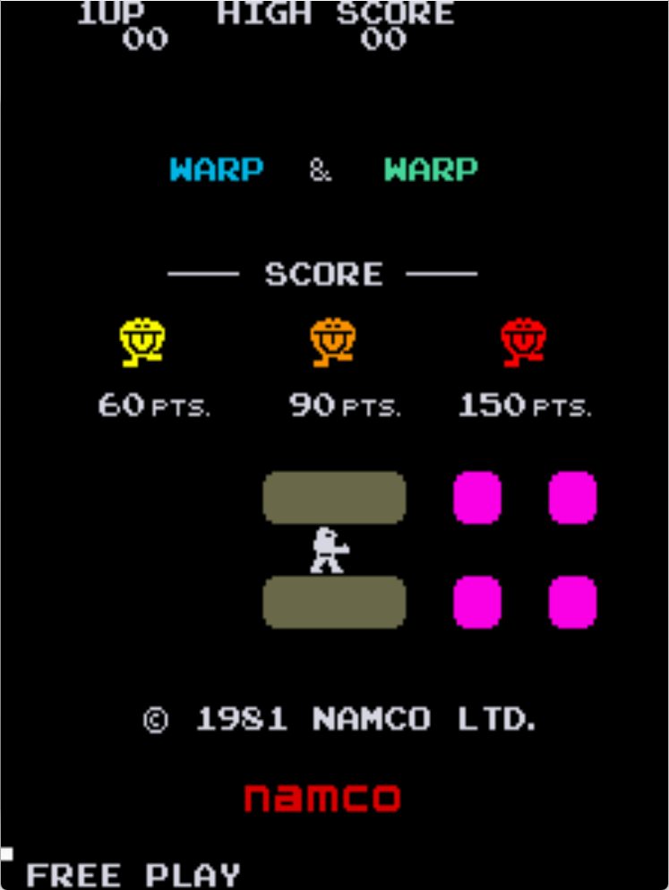

# Warp Warp Freeplay
This is a mod to original Warp Warp ROMs that adds attract mode to the free play setting. It can be used with credits enabled as well as free play mode. These patches are meant to be used with LunarIPS or other similar patching utilities.

*Note that this removes the ROM check part of the self test.*

## Patch information
### Supported ROM Sets
| **ROM Set** | **MAME Working?** | **Machine Working?** |
|-------------|:-----------------:|:--------------------:|
| warpwarp    |        Yes        |       Untested       |
| warpwarpr   |        Yes        |       Untested       |
| warpwarpr2  |        Yes        |       Untested       |

### warpwarp
| **Patched ROM Name** | **Size** | **CRC-32 Checksum** | **IC Location** |
|----------------------|----------|---------------------|-----------------|
| ww1_prg1.s10         |    4k    |       079EC462      |       S10       |
| ww1_prg3.s4          |    4k    |       26CF635B      |       S4        |

### warpwarp
| **Patched ROM Name** | **Size** | **CRC-32 Checksum** | **IC Location** |
|----------------------|----------|---------------------|-----------------|
| g-09601.2r           |    4k    |       98228101      |       2R        |
| g-09603.1p           |    4k    |       48402B02      |       1P        |

### warpwarp
| **Patched ROM Name** | **Size** | **CRC-32 Checksum** | **IC Location** |
|----------------------|----------|---------------------|-----------------|
| g-09601.2r           |    4k    |       98228101      |       2R        |
| g-09603.1p           |    4k    |       48402B02      |       1P        |

## DIP Switch Setting
This is found on DPSW 1 on the game PCB. It uses switches 1 and 2.

| **Coin/Credit** | **1** | **2** |
|----------------:|:-----:|:-----:|
|             2/1 |   On  |  Off  |
|             1/1 | *Off* | *Off* |
|             1/2 |  Off  |   On  |
|       Free Play |   On  |   On  |

## Modification Documentation
To Do

## Images

