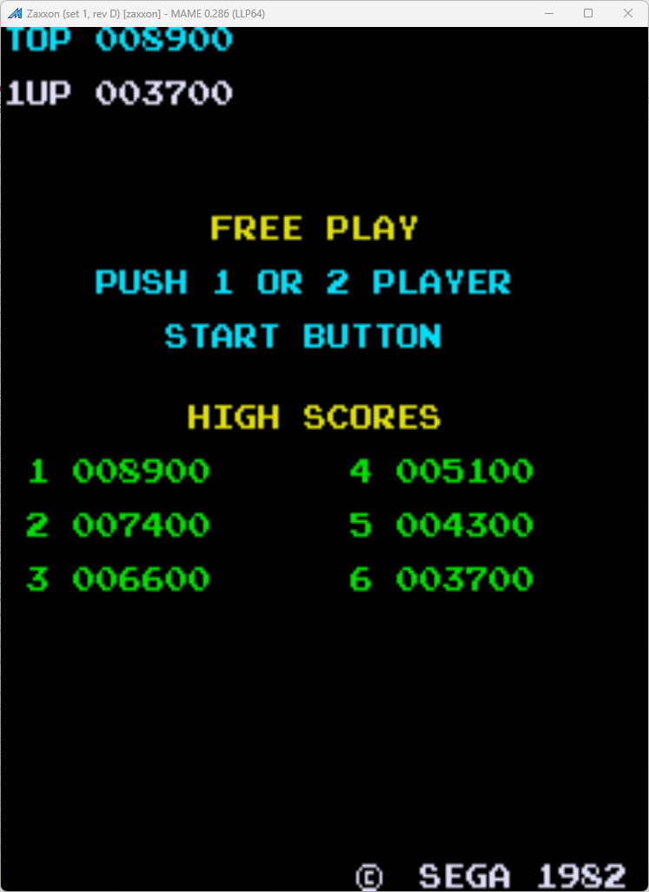

# Zaxxon Freeplay
This is a mod to original Zaxxon Rev D ROMs that adds free play to the game. 

## Patch information
One patch are provided for the *zaxxon* ROM set as found in MAME. It has been tested for this ROM set only and may not work on other revisions of Zaxxon. The patches are designed to be used with LunarIPS. 


| **Patched ROM Name** | **Size** | **CRC-32 Checksum** | **IC Location** |
|----------------------|----------|---------------------|-----------------|
| zaxxon_rom3d.u27     |    8k    |       0767F96F      |        U27      |

## Modification Documentation
The freeplay mod was actually a weird one. The code has a suprising amount of similarities to Donkey Kong. For example, its game mode variable is exactly the same as DK. I want to investigate it a bit further. This documentation is unfinished.

### Noteworthy Places in Memory
- 0x6005: Game Mode
    - 0x00 = startup/not initialized
    - 0x01 = attract mode
    - 0x02 = credit screen, awaiting start
    - 0x03 = game mode
- 0x6012: Credit Count
- 0xC100: Credit and Start Button Inputs

### Credit Routine
```z80asm
0x00A0   Ld a, ($6005)     3A 04 60   //Load the game state
0x00A3   cp 01             FE 01      //See if we are in attract
0x00A5   jr nz D8          20 31      //Continue on
0x00A7   ld a, ($C100)     3A 00 C1   //Read the start inputs
0x00AA   and 0c            E6 0C      //Only proceed if we read the start buttons
0x00AC   jr z D8           28 2A      //skip if we do not have anything
0x00AE   ld hl, 6012       21 12 60   //Load the credit count
0x00B1   ld (hl), 0        36 00      //Clear Credit Count
0x00B3   and 08            E6 08      //See if player 2 was held down
0x00B5   jr z 01           28 01      //1P game, so only load one credit
0x00B7   inc (hl)          34         //increment credit count
0x00B8   inc (hl)          34         //increment credit count
0x00B9   jr D8             18 1D      //Go back to normal operation
```

### Auto Start Routine
```z80asm
0x00BB   ld hl 6002        21 02 60   //Load our flag
0x00BE   ld a, hl          7E         //copy it to A
0x00BF   and a             A7         //If set
0x00C0   jr nz 02          20 02      //Jump to game start
0x00C2   inc (hl)          34         //Else set flag
0x00C3   ret               C9         //return back to start code, there is a weird glitch if it doesn't run at least once
0x00C4   ld (hl), 0        36 00      //clear the flag
0x00C6   ld a, 6012        3A 12 60   //load credit count
0x00C9   rla               17         //shift left twice to mimic controls
0x00CA   rla               17
0x00CB   ret               C9         //return back to start code
```

### ROM Padding and Self Test Checksums
Zaxxon has a test mode that verifies the ROM integrity by reading the checksums and also tests the RAM. It checks against the following checksums for REV D:
| **ROM** |  **Test Range** | **Checksum** | **Checksum Location** |
|:-------:|:---------------:|:------------:|:---------------------:|
|    1    | 0x4000 - 0x4BFF |     AC1A     |    0x4FFA - 0x4FFB    |
|    2    | 0x2000 - 0x3FFF |     DE22     |    0x4FFC - 0x4FFD    |
|    3    | 0x0000 - 0x1FFF |     DD21     |    0x4FFE - 0x4FFF    |

One noteworthy thing to note is that ROM1's entire range is not taken into account. The self test ends after reading 0x4BFF.

Due to modifications being necessary, one of two things need to happen: ROM3 needs to be padded or the appropriate checksum needs to be changed in ROM1. In order to limit the number of required new ROMs, the padding approach was taken. The following byte string was added to pad the ROM:
```
0x00CC   FF FF 15
```

### Changed Sentences
Like with Donkey Kong and Radar Scope, Zaxxon had pre-programmed sentences that would get printed to the screen. It was required to change these so that it would say that the game is free play. The following strings were changed:
```
0x046E   10 16 22 15 15 10 20 1C 11 29 10                              //FREE PLAY
0x047C   10 20 25 23 18 10 01 10 1F 22 10 02 10 20 1c 11 29 15 22 10   //PUSH 1 OR 2 PLAYER
0x0493   10 10 10 23 24 11 22 24 10 12 25 24 24 1F 1E 10 10 10 10 10   //START BUTTON
```

### Character Table (Incomplete)
|  Hex | Character |
|:----:|:---------:|
| 0x10 |  [Space]  |
| 0x11 |     A     |
| 0x12 |     B     |
| 0x13 |     C     |
| 0x14 |     D     |
| 0x15 |     E     |
| 0x16 |     F     |
| 0x17 |     G     |
| 0x18 |     H     |
| 0x19 |     I     |
| 0x1A |     J     |
| 0x1B |     K     |
| 0x1C |     L     |
| 0x1D |     M     |
| 0x1E |     N     |
| 0x1F |     O     |
| 0x20 |     P     |
| 0x21 |     Q     |
| 0x22 |     R     |
| 0x23 |     S     |
| 0x24 |     T     |
| 0x25 |     U     |
| 0x26 |     V     |
| 0x27 |     W     |
| 0x28 |     X     |
| 0x29 |     Y     |
| 0x2A |     Z     |

### Injected Routines
0x087B: ld a, C100   ->   Call 0x00BB //start routine

## Images
