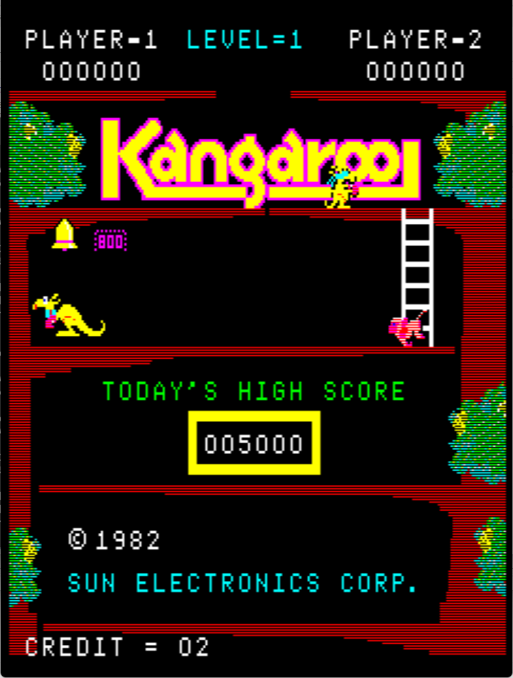
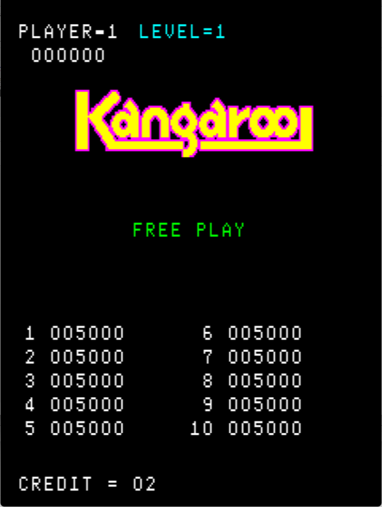

# Kangaroo Freeplay
This is an improved freeplay mod for Atari Kangaroo. It can be used with credits enabled as well as free play mode. These patches are meant to be used with LunarIPS or other similar patching utilities.

*Note that this removes the ROM check part of the self test.*

**This mod is also still in progress, there are expected changes ahead.**

## Patch information
### Supported ROM Sets
| **ROM Set** | **MAME Working?** | **Machine Working?** |
|-------------|:-----------------:|:--------------------:|
| kangaroo    |        Yes        |       Untested       |

### kangaroo
| **Patched ROM Name** | **Size** | **CRC-32 Checksum** | **IC Location** |
|----------------------|----------|---------------------|-----------------|
| tvg_75.0             |    4k    |       98985403      |                 |
| tvg_78.3             |    4k    |       7882A880      |                 |
| tvg_79.4             |    4k    |       17B561FF      |                 |
| tvg_80.5             |    4k    |       E4B6AFE3      |                 |

## DIP Switch Setting
This is found on 8 position dip switch on the game PCB. It uses switches 5, 6, 7, and 8.

| **Coin/Credit** | **5** | **6** | **7** | **8** |
|----------------:|:-----:|:-----:|:-----:|:-----:|
|             1/1 | *Off* | *Off* | *Off* | *Off* |
|       Free Play |   On  |   On  |   On  |   On  |

## Modification Documentation
To Do

## Images

